# Group Project: Design Journey

**For each milestone, complete only the sections that are labeled with that milestone.** Refine all sections before the final submission.

You are graded on your design process. If you later need to update your plan, **do not delete the original plan, leave it in place and append your new plan _below_ the original.** Then explain why you are changing your plan. Any time you update your plan, you're documenting your design process!

**Replace ALL _TODOs_ with your work.** (There should be no TODOs in the final submission.)

Be clear and concise in your writing. Bullets points are encouraged.

Place all design journey images inside the "design-plan" folder and then link them in Markdown so that they are visible in Markdown Preview.

**Everything, including images, must be visible in _Markdown: Open Preview_.** If it's not visible in the Markdown preview, then we can't grade it. We also can't give you partial credit either. **Please make sure your design journey should is easy to read for the grader;** in Markdown preview the question _and_ answer should have a blank line between them.

## Client (Milestone 1)

### Client Description (Milestone 1)
> Tell us about your client. Who is your client?
> Explain why your client meets the client rules in the project requirements.

Our client is cornell concert commission. They meet the rules of the project because they are a client in need of a website and we do not have any personal
relationship within the club.

### Client Questionnaire (Milestone 1)
> Develop a client questionnaire to learn more about your client and their goals.
> You may use the questionnaire below, you may modify the questionnaire below, or you may create your own.

1. Describe your organization and its purpose.

     The Cornell Concert Commission is a student organization at Cornell University dedicated to organizing and promoting live music events on campus. Our purpose is to bring diverse and exciting musical performances to the student body, enhancing campus life through music.

2. What makes your organization and its services special or unique?

    CCC is the only organization on campus that offers concerts of such a large scale and brings in artists from the indie and mainstream scenes that students want to hear on a regular basis. It also fosters a unique club culture, and provides students with the unique experience of working on the floor of a concert.

3. Why are you looking for a new website or updating your existing site?

    Our current site is managed through Cornell Blogs and therefore is easy to manage but looks boring and doesn't have good discoverability. It also doesn't represent the club or it's current atmosphere well.

4. Who do you want to visit your site? Who do you believe is your website's intended audience?

    Our website will be for anyone who wants to know about the club. This will probably primarily be students, faculty, community members, and maybe others involved in the local music scene, but the club's rich history is interesting to anyone with a cursory knowledge of the club.

5. When visiting your site, what actions do you want your visitors to take?

    We want most visitors to see the information about our latest concerts and promotions, and to know how to participate with and engage with the club if they want to. It's also an option to learn detailed information about the club such as eboard members or past shows.

6. What are your goals for this site?

    The biggest goal for this site is to present information about current club events in a way that is exciting and drives public interest in the club. We want to show people that the club and the concerts are exciting and that there is vibrant culture behind them, things the current site does not convey.

7. Is there a "feel" that you want for your site? Are there colors or imagery that you have in mind?

    Black and white are the main colors of the club, which evokes a professional feel, but we want the imagery and stylings to feel slick, modern, and alternative to reflect the club culture.

8. What are your three favorite competitors or similar organizations' websites? Why?

    Pitchfork's website is a similar style to what we want to evoke: sleek and modern yet exciting and alternative. They are also a music site. Two other sites to keep in mind are the club's current site, which despite a bad style has decent organization, and the club's instagram, which the website should stand out from in order to justify its existence.

### First Client Meeting Minutes/Notes (Milestone 1)
> Include your notes/minutes from your first meeting with your client.

First Client Meeting Minutes/Notes

Date: [Insert Date]

Attendees:
Client Representative (Cornell Concert Commission)
Web Design Team (Our Team)

#### Meeting Agenda:

Introduction and Welcoming
Review of Client Questionnaire Responses
Discussion on Organization and Purpose
Goals and Expectations for the New Website
Design Preferences and Visual Theme
Preferred Features and Functionality
Competitor Websites and Inspiration
Next Steps and Timeline

Meeting Notes:
Introduction and Welcoming:

The meeting commenced with introductions and a warm welcome from the web design team to the client representative from the Cornell Concert Commission.
Review of Client Questionnaire Responses:

The team presented and discussed the responses from the client questionnaire. The client's organization, purpose, and unique features were clarified.
Discussion on Organization and Purpose:

The client emphasized the importance of bringing diverse and exciting musical performances to the student body. They highlighted the unique club culture and experience of working on the floor of a concert that CCC offers.
Goals and Expectations for the New Website:

The primary goal for the new website is to present information about current club events in an exciting manner to drive public interest. The client expressed a desire for a site that reflects the vibrant culture behind the concerts and fosters engagement.
Design Preferences and Visual Theme:

The client specified a preference for a black and white color scheme, aligning with the club's main colors. The desired "feel" for the site is described as sleek, modern, and alternative to convey professionalism and excitement.
Preferred Features and Functionality:

The team and client discussed features such as highlighting current concerts and promotions, providing information on how to participate and engage with the club, and offering detailed information about the club's history and members.
Competitor Websites and Inspiration:

Pitchfork's website was identified as a source of inspiration, resonating with the desired sleek and modern yet exciting and alternative style. The client also highlighted the need for the new website to stand out from the club's current website and Instagram.
Next Steps and Timeline:

The team discussed the next steps, including further research, sketching layout ideas, and developing a visual theme. A tentative timeline was outlined, considering the client's preferences and the need for a polished and engaging website.

### Client Website (Milestone 1)
> Tell us about the website that your client wants.
> Tell us the purpose of the website and what it is all about.
> Note: **If you are redesigning an existing website, give us the current URL and some screenshots of the current site.** (FireFox makes it easy to take a full screenshot of a page from the context menu (right click).)
> If you are redesigning an existing site, tell us how you plan to update the site significantly that meets the project's requirements.

The client, the Cornell Concert Commission, is in need of a website. The purpose of this website is to serve as the primary platform for promoting and managing live music events on Cornell's campus. The website will feature information about upcoming concerts, artist profiles, ticket sales, and integration with their social media. The website our client wants is a website that will engage their target audience, primarily Cornell students, faculty, staff, and local music enthusiasts. It will also help in promoting their events effectively and increasing ticket sales.

### Client Goals (Milestone 1)
> Identify your client's goals for the website.
> What kind of website do they want? What are their goals for the site?
> There is no required number of goals. You need as many goals as necessary to reflect your client's desires.

- Improved User Experience: Create a user-friendly and modern website that is easy to navigate, ensuring visitors can quickly access event information and purchase tickets.
- Increased Ticket Sales: The website should encourage ticket sales for their events by providing a seamless ticket purchasing experience.
- Enhanced Online Presence: The website should serve as a central hub for their community.

### Client Website Scope (Milestone 1)
> We want your project to be successful! It needs to be ambitious, but not too large.
> A good rule-of-thumb is that you should have about 1 content-full page for each team member.
> Explain why the website you will create for your client isn't too small and isn't too big.
> Explain why you think it's the right size for this project.

It aims to fulfill the specific needs of the Cornell Concert Commission by providing essential features for event promotion, ticket sales, and audience engagement. The website scope is not too small, as it covers a range of features like event listings, artist profiles, and ticket sales, which meet the client's objectives. It's not too large, as it focuses on core functionalities, ensuring that the website remains manageable and is completed within a reasonable timeframe.

## Plan/Schedule (Milestone 1)
> Make a plan of when you will complete all parts of this assignment.
> This plan is for your team. There is no required format. Format it so that it works for you!
> Your plan should include when you will interview users and analyze their goals.
> Your plan should also include how and when you will assemble/create the sit's content.
> **Tip:** Your team should plan to work ahead. This project really isn't feasible to complete the night before a deadline.

We will follow the milestones of the class in order to make sure that we complete all parts of this assignment. We will assemble the sites content by catering the content towards the goal audience and asking the client for specific content that is needed to fufill the goal. We will assemble the sites content during the second milestone. We will interview users a and analyze their goals a week before milestone 2 is due.

- 19th Oct - 25th Oct
  - Establish Team Contract
  - Design client selection and design for client quesitonnaire
  - Interview the users

- 26th Oct - 1st Nov
  - Collect and create sites content (by recording information directly from the interview, requesting additional text and image materials from the organization)
  - User goals and audience analysis
  - Content planning and visual theme planning
  - Draft HTML

- 2nd Nov - 8th Nov
  - Assemble website's content
  - Interactivity Design
  - Draft CSS

- 9th Nov - 15th Nov
  - Interactivity Implementation
  - Meet with client again and get feedback from them

- 16th Nov - 22nd Nov
  - Conduct user testing

- 23rd Nov - 29th Nov
  - Finilize website

## Understanding Users (Milestone 2)

**Make the case for your decisions using concepts from class, as well as other design principles, theories, examples, and cases from outside of class.**

You can use bullet points and lists, or full paragraphs, or a combo, whichever is appropriate. The writing should be solid draft quality, but it doesn't have to be fancy.

### User Interview Questions (Milestone 2)
> Plan the user interview which you'll use to identify the goals of your site's audience.
> You may use the interview template below and revise it as much as you desire.

**User Interview Briefing & Consent:** "Hi, I am a student at Cornell University. I'm currently taking a class on web design and for a project, I am designing the website for Cornell Concert Comission. I'm trying to learn more about the people that might use this site. May I ask you a few questions? It will take about 10 minutes. You are free to quit at any time."

1. Please tell me a bit about yourself. You may omit any personal or private information.
2. What music genres or artists do you generally prefer?
3. Have you ever visited a Cornell Concert Commission's ? If yes, how did you find your information?
4. How do you usually discover or learn about music events?
5. What kind of information or content do you seek out for a music event?
6. Can you recall a time when you faced challenges or difficulties when trying to find information about a music event?
  6a. If yes, What was that information?

1. What haven't I asked you today that you think would be valuable for me to know?

**After the interview:** "This was really helpful. Thank you so much for agreeing to speak with me today. Have a great day!"

### Interview Notes (Milestone 2)
> Interview at least 1 person for every member of your team from your audience.
> Take notes and include those notes here. Make sure to include a brief description of each interviewee.
> **Copy the interview questions above into each interviewee section below.**
> Take notes for each participant **inline** with the questions.

**Interviewee 1:**

Description: College student majoring in computer science, enjoys a variety of music genres, has attended a Cornell Concert Commission event in the past.

1. Please tell me a bit about yourself.

Participant introduced themselves as a computer science major who enjoys attending live music events.
2. What music genres or artists do you generally prefer?

  Enjoys indie and alternative music but appreciates a variety of genres.

3. Have you ever visited a Cornell Concert Commission's event? If yes, how did you find your information?

  Attended a CCC event and found information through social media and friends.

4. How do you usually discover or learn about music events?

  Primarily through social media platforms, especially Instagram and Facebook.

5. What kind of information or content do you seek out for a music event?

  I look for details about the performing artists, ticket prices, and venue information.

6. Can you recall a time when you faced challenges or difficulties when trying to find information about a music event?

  Yes I have faced challanges finding information about a music event a few times

6a. If yes, What was that information?

  Experienced difficulty finding specific set times for artists during an event.

7. What haven't I asked you today that you think would be valuable for me to know?

  Suggested including a feature that allows users to save and share their favorite events.

**Interviewee 2:**

Description: Graduate student studying business, a fan of classical and jazz music, not familiar with Cornell Concert Commission events.

Please tell me a bit about yourself.

Participant is a graduate student studying business and has a preference for classical and jazz music.
What music genres or artists do you generally prefer?

Enjoys classical and jazz music.
Have you ever visited a Cornell Concert Commission's event? If yes, how did you find your information?

Not familiar with CCC events, usually attends classical music performances.
How do you usually discover or learn about music events?

Discovers events through online music forums and classical music organizations.
What kind of information or content do you seek out for a music event?

Looks for detailed program information, performer biographies, and ticket availability.
Can you recall a time when you faced challenges or difficulties when trying to find information about a music event?

Faced challenges finding comprehensive program details for classical concerts.
6a. If yes, What was that information?

Comprehensive program details for classical concerts.
What haven't I asked you today that you think would be valuable for me to know?

Suggested incorporating a feature for users to receive notifications about upcoming events in their preferred genres.

**Interviewee 3:**

Description: Graduate student studying engineering, a fan of musicals, not familiar with Cornell Concert Commission events.

1. Please tell me a bit about yourself. You may omit any personal or private information.

  I’m a graduate student in MEng electrical and computer engineering.

2. What music genres or artists do you generally prefer?

  I enjoy a wide range of music but have a specific interest in musicals and bel canto.

3. Have you ever visited a Cornell Concert Commission's ? If yes, how did you find your information?

  No I haven’t.

4. How do you usually discover or learn about music events?

  Im in Cornell chorus and I often learn about music events from my peers. Also I have subscription of Cornell Concert Series.

5. What kind of information or content do you seek out for a music event?

  I want to get information about the upcoming events, including the date, ticket price and location, and the detailed description of the performer.

6. Can you recall a time when you faced challenges or difficulties when trying to find information about a music event? 6a. If yes, What was that information?

  Yes. I found that the information about the performance our Cornell Chorale will perform is very hard to find online.

7. What haven't I asked you today that you think would be valuable for me to know?

  Nothing else.

**Interview 4:**

1. Please tell me a bit about yourself. You may omit any personal or private information.

    21 year old information science major

2. What music genres or artists do you generally prefer?

    Into a bit of everything but really enjoys rap and RnB music. People like Tee Grizzly, A Boogie, and Lil Baby

3. Have you ever visited a Cornell Concert Commission's ? If yes, how did you find your information?

  Has not been to any Cornell concert commission events. Doesn’t know much about them

4. How do you usually discover or learn about music events?

    Find out about on campus events through postering on campus and flyers from members of those groups. Sometimes through social media

5. What kind of information or content do you seek out for a music event?

  Wants to know location, date, time, performers, guest performers, etc

6. Can you recall a time when you faced challenges or difficulties when trying to find information about a music event? 6a. If yes, What was that information?

    Sometimes struggles to understand what event is happening where. Wishes that there was one main source of information

7. What haven't I asked you today that you think would be valuable for me to know?

    Wished they had more details on the vibes of concert, is it chill, energetic, etc?

**Interview 5**

1. Please tell me a bit about yourself. You may omit any personal or private information.

	  My name is Claire and I am a junior at Cornell University studying DEA. I am from California.

2. What music genres or artists do you generally prefer?

	  I listen to a lot of indie music and sad music. I like Mitski, MenITrust, and Grimes.

3. Have you ever visited a Cornell Concert Commission's ? If yes, how did you find your information?

	  Never visited website, been to a couple concerts at Cornell. I find information usually through Instagram because I follow CCC.

4. How do you usually discover or learn about music events?

	  Usually through friends or Instagram.

5. What kind of information or content do you seek out for a music event?

	  Who the artist is, when is it, and where.

6. Can you recall a time when you faced challenges or difficulties when trying to find information about a music event?

    6a. If yes, What was that information?

	Yes, I sometimes learn about events too late and tickets are already sold out.

7. What haven't I asked you today that you think would be valuable for me to know?

	  Not a question, but ticket prices are not big concern at CCC.

### Goals (Milestone 2)
> Analyze your audience's goals from your notes above.
> List each goal below. There is no specific number of goals required for this, but you need enough to do the job (Hint: It's more than 1 and probably more than 2).

Goal 1: Get Event Times

- **Design Ideas and Choices** _How will you meet those goals in your design?_
  - Clearly display set times for each artist during an event.
  - Implement a user-friendly information for events.
- **Rationale & Additional Notes** _Justify your decisions; additional notes._
  - This goal addresses the challenge mentioned by Interviewee 1 regarding difficulties in finding specific set times for artists during an event.

Goal 2: Gain more Knowledge on the CCC

- **Design Ideas and Choices** _How will you meet those goals in your design?_

  - Develop an informative section on the website that provides insights into CCC's history, mission, and notable achievements.

- **Rationale & Additional Notes** _Justify your decisions; additional notes._

  - This goal focuses on enhancing users' understanding of the Cornell Concert Commission, ensuring that the website serves as a comprehensive resource for gaining knowledge about the organization. It aligns with the interviewees goal of learning more about the CCC and how to join.

Goal 3: Get Location of Events

- **Design Ideas and Choices** _How will you meet those goals in your design?_

  - Develop a section where we have location details and maps. As well as information related to parking and how to get to the event locations.

- **Rationale & Additional Notes** _Justify your decisions; additional notes._
  - This goal addresses the challenge mentioned by multiple interviews regarding where the events are located and how they can get there.

### Audience (Milestone 2)
> Briefly explain your site's audience.
> Be specific and justify why this audience is a **cohesive** group with regard to your website.

Cornell students that are interested/want to be involved in the music community and attending music events.

This group is cohesive because they share a common interest in music and a desire to engage with the CCC's offerings. Their collective interest creates shared goals of accessing information about upcoming events, understanding the CCC's mission, and potentially becoming involved in the organization. The website, designed to cater to these shared interests, serves as a centralized platform for students to explore, learn, and actively participate in the vibrant music culture fostered by the CCC, thereby solidifying the group's cohesiveness.

## Website Design Exploration (Milestone 2)

Identify three websites (preferably static websites) that exist today on the web to draw inspiration from. Please select websites that are similar to the website you wish to create.

Include two screenshots of the home page for each site: narrow and wide.

**We'll refer to these are your "example websites."**

1. <https://pitchfork.com>

    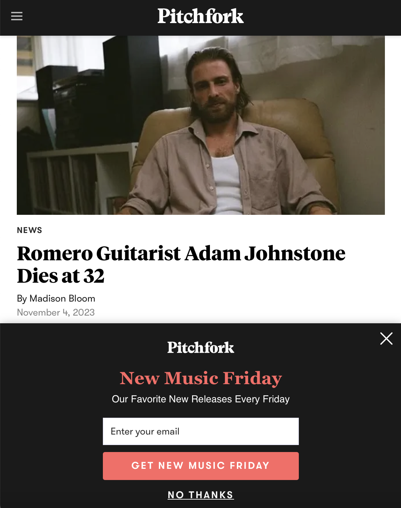

    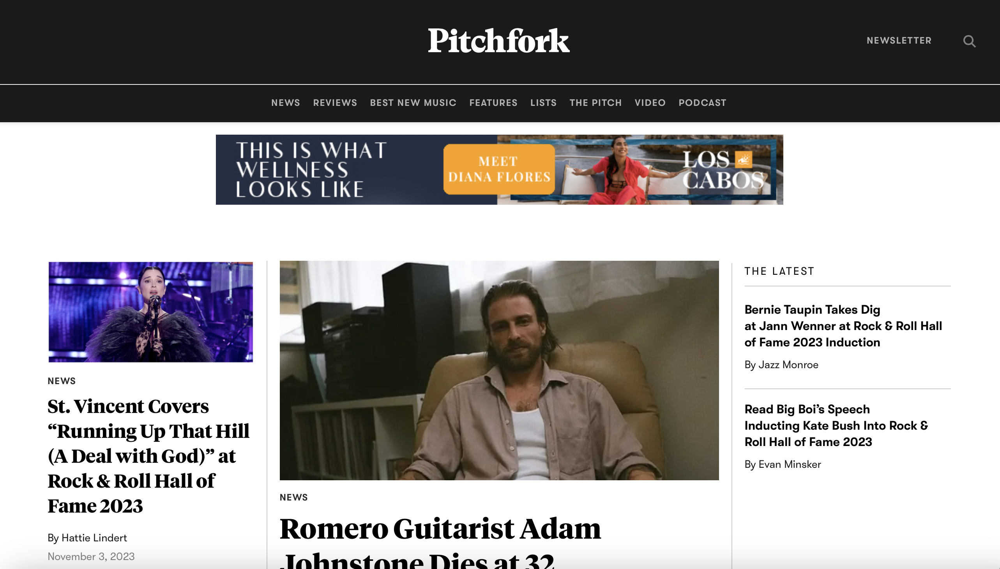

2. <https://charleycrockett.com/>

    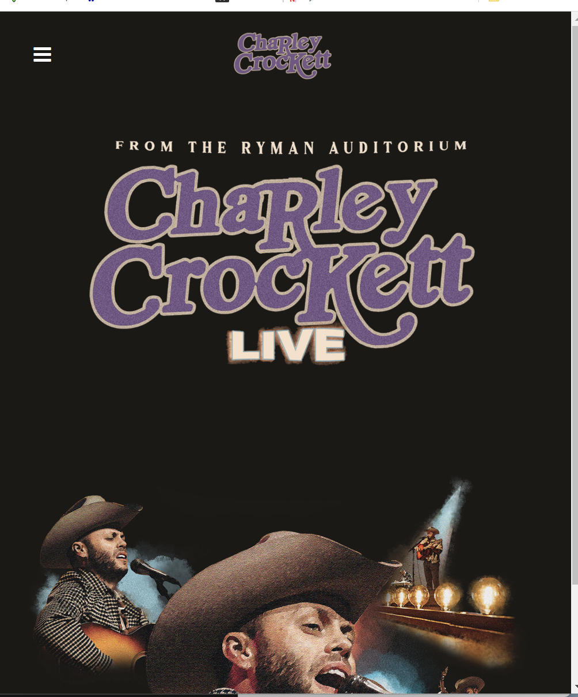

    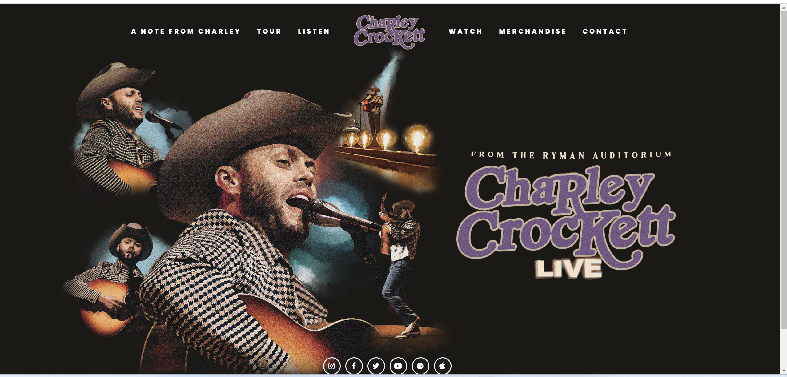

3. <https://stevebenjamins.com/>

    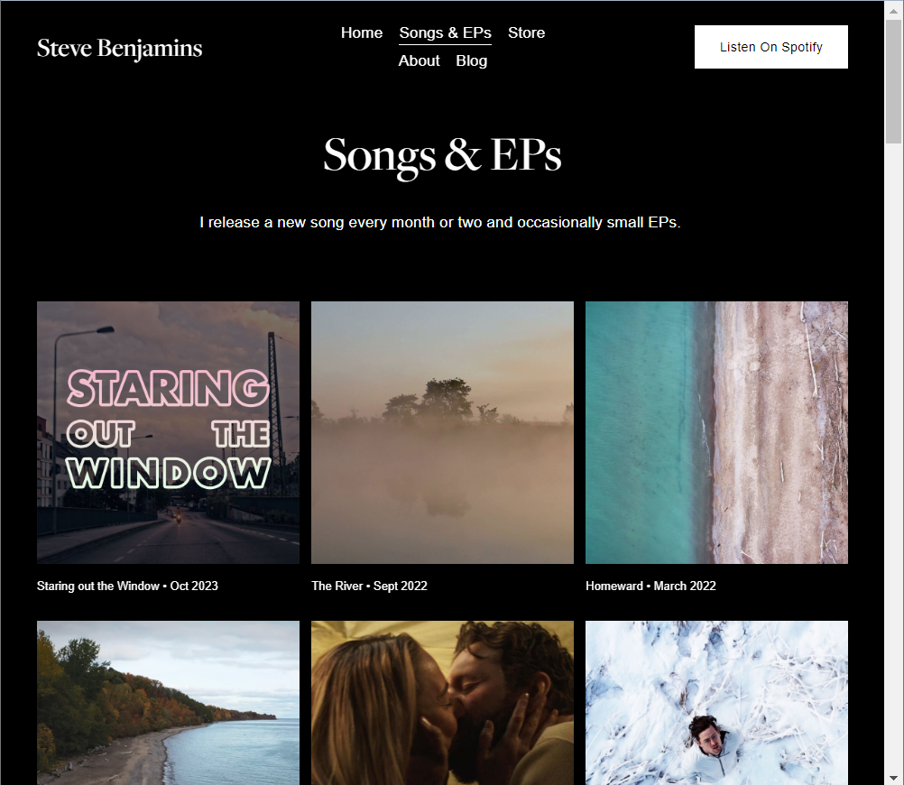

    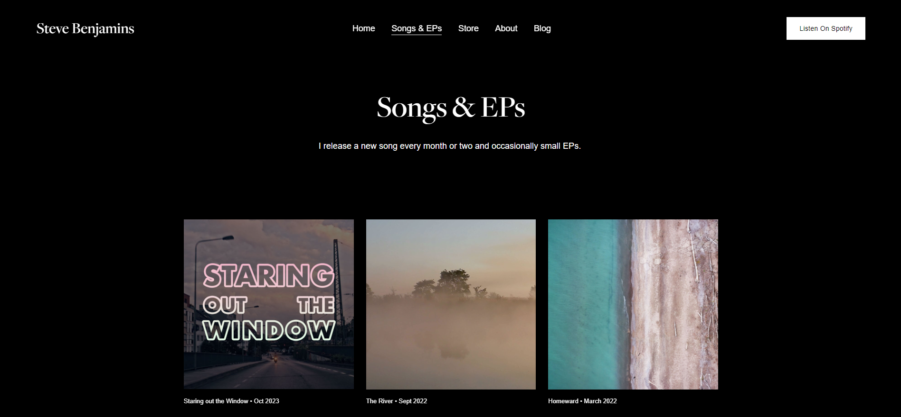

### Example Website 1 Review (Milestone 2)
> Review the website you identified above. (1 paragraph)
> In your review, include a discussion common design patterns and interactivity in the site.

Pitchfork's website features a clean and modern design, with a prominent navigation bar for easy access to various sections. Its design effectively highlights featured content, articles, and upcoming events. The homepage employs a grid layout to showcase featured content, providing an organized and visually appealing presentation. It employs common design patterns, including responsive navigation menu and side bars. The responsive design seamlessly adapts to different screen sizes, and the transition to a hamburger menu on narrow screens ensures a smooth and clutter-free mobile experience. For the interactivity on this website, it employs a modal for subscriptions of newsletter enhances user engagement and encouraging users to subscribe while minimizing disruption to the overall browsing experience. The use of hamburger menu provides a compact and accessible navigation option, allowing users to easily explore different sections of the website without cluttering the interface.

### Example Website 2 Review (Milestone 2)
> Review the website you identified above. (1 paragraph)
> In your review, include a discussion common design patterns and interactivity in the site

I think that website is very well made, the color theme matches of dark colors is very aesthetically pleasing and draws attention to the content. The design patterns and interactivity used such as the hamburger menu on the narrow screen and the youtube videos are allow me to easily navigate through the site and find nesscessary information. The minimalist approach, combined with clear call-to-action elements, guides users seamlessly through the site, ensuring that important information, such as upcoming events or ticket sales, is easily accessible and prominently displayed. This emphasis on user-friendly design principles contributes to a positive user experience, encouraging visitors to explore the website and participate in the club's activities.

### Example Website 3 Review (Milestone 2)
> Review the website you identified above. (1 paragraph)
> In your review, include a discussion common design patterns and interactivity in the site.

The website is very simple and organized, with a consistent theme/aesthetic throughout all the pages. The layout allows users to easily find necessary information on songs, albulm purchasing, about the artists, and more. The clean, yet detailed approach in the design of the website, along with the creative use of images being used as links, videos, and a responsive footer contributes to a user-friendly website that encourages users to explore more and dive deeper into the website. It employs common design pattern including hamburger navigation menu. Also, it uses modals including subscriptions to newsletter to improve its interactivity.

## Content Planning (Milestone 2)

Plan your site's content.

### Your Site's Planned Content (Milestone 2)
> List **all** the content you plan to include your website.
> You should list all types of content you planned to include (i.e. text, photos, images, etc.)
> Briefly summarize the content; do not include the content here.

- Text about Cornell Concert Comission/Who they are/What they do
- Images on upcoming
- Images on past events
- Images of the e-board members
- Text about contact information
- FAQ text
- Rules text
- Text about past events
- Text about upcoming event
- Text on how to join CCC
- Logo

### Content Justification (Milestone 2)
> Explain (about a paragraph) why this content is the right content for your site's audience and how the content addresses their goals.
>
 The text about Cornell Concert Commission serves to provide a comprehensive overview, addressing users' curiosity about the organization's identity, mission, and activities. Including images of upcoming and past events, along with the e-board members, not only adds visual appeal but also allows users to connect with the culture and leadership of the club and gain information about the club. Text about contact information facilitates easy communication for users interested in participation or seeking more information. Descriptions of past and upcoming events serve to keep the audience informed and engaged. Information on how to join CCC encourages user involvement and aligns with their potential goal of becoming part of the organization. Lastly, featuring the club's logo enhances brand recognition and establishes a visual identity for the Cornell Concert Commission. Collectively, this content addresses the audience's varied interests, information needs, and potential engagement goals.

## Information Architecture (Milestone 2)

### Content Organization (Milestone 2)
> Document your **iterations** of card sorting here. You must have at least 2 iterations of card sorting.
> Include photographic evidence of each iteration of card sorting **and** description of your thought process for each iteration.
> Please physically sort cards; please don't try and do this digitally.

**Iteration 1**

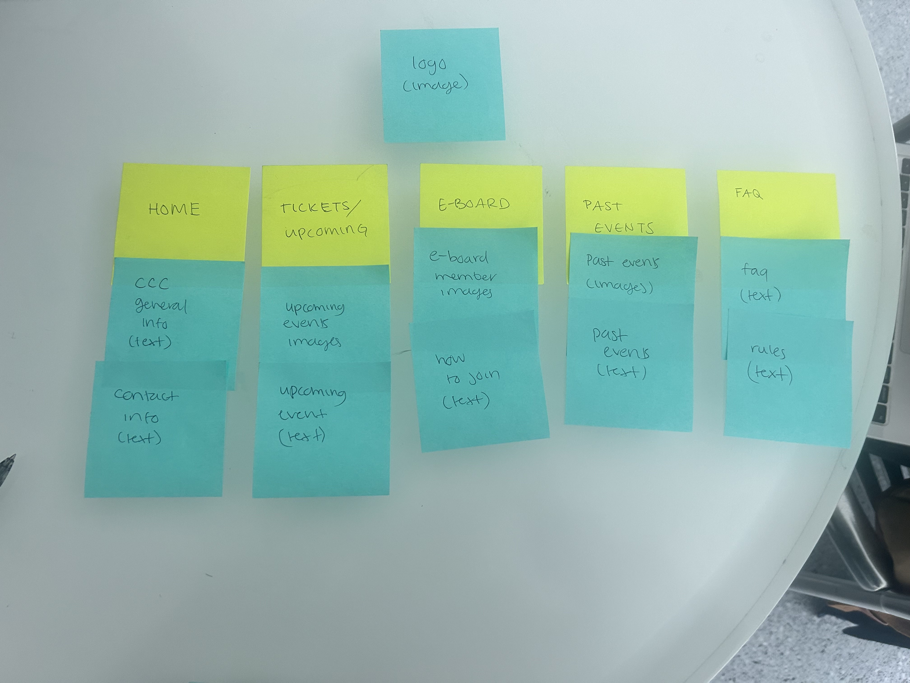

this iteration of sketch priotizing the order of information. It places information like the contact information on the home page and how to join information on the e-board page for ease of access

**Iteration 2**
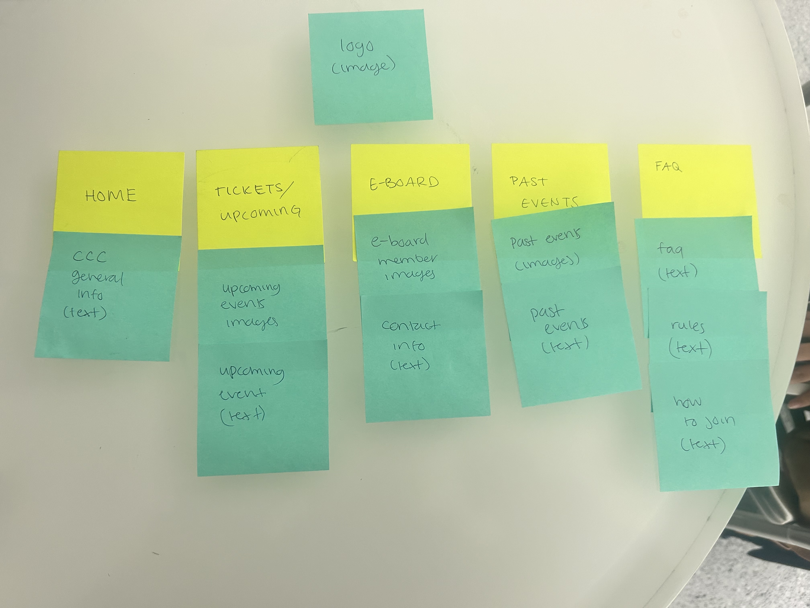
We tried putting how to join in the FAQ page to see if that would make more sennse.

### Final Content Organization (Milestone 2)
> Which iteration of card sorting will you use for your website?

We will use the first iteration of card sorting, sort 1.

> Explain how the final organization of content is appropriate for your site's audiences.

This make sense for our audience as it groups all relevent information together and makes it so that they can access all necessary information on the go.

### Navigation (Milestone 2)
> Please list the pages you will include in your website's navigation.

- Upcoming events page
- Home page
- FAQ page
- E-board page
- Past events

> Explain why the names of these pages make sense for your site's audience.

The chosen names for the website's navigation pages are carefully crafted to resonate with the interests and goals of the Cornell Concert Commission's diverse audience. The "Upcoming Events" page directly addresses the audience's interests in staying informed about upcoming concerts and events, including ticket details. The "Home" page serves as a welcoming and central hub, providing a comprehensive overview of the organization's identity, mission, and purpose. The "FAQ" page caters to potential members and event attendees, offering clear guidelines and answers to common queries. The "E-board" page introduces the club's leadership, fostering a connection between the audience and the individuals driving the organization. Lastly, the "Past Events" page appeals to users interested in the club's history and previous activities, aligning with their potential curiosity and desire to explore the organization's  background.

## Visual Theme (Milestone 2)
> Discuss several (more than two) ideas about styling your site's theme. Explain why the theme ideas are appropriate for your target audiences. Note the theme you selected for your site and why it's appropriate for the audience and their goals.

One of the main goals for this project is to improve the website from the current cornell blogs website. In our initial interaction with the client, the main thing they seemed to highlight about the existing website was that it felt too stiff, and more resembled what one might expect from a website of an academic club. It also feels a bit "old web." They said they wanted CCC's public presence to be more hip and lighthearted. Therefore, one idea for a theme would be a very flashy, almost even tacky or punk bright theme that emphasized the club's alternative spirit and the students (rather than fauclty / organizations) behind it. This theme would seek to be as inviting as possible to other students seeking an unprofessional, casual club, using rounded letters and shapes, and lots of flashy, contrasting bright colors.

The first idea leans heavily into the casual, alternative aspects of the club, but it's also important to emphasize the club's professional side. CCC is proud of its long history of hosting noteworthy artists, as well as the professional relationship it seeks to have with its clients and with cornell's administration. This second theme idea balances the professionality of the club with the desire to have a "cooler," more modern feeling website. Like the club's logo, this theme primarily uses white content on a black background. This simple, minimalist color palette  looks professional, and the black background with white text is reminiscent of "dark mode" websites or applications, which is notoriously popular among young people. Balance between profesionality and modernity can also be achieved with sharp lines and corners around text and content boxes, while using rounded, inviting, casual text for contrast. This also follows the aesthetic of many modern music websites such as pitchfork, which use minimalist color palettes and clearly defined borders.

We ended up choosing the second theme because while it maintains the goal of creating a sleeker, younger looking website, it doesn't alienate older viewers or sacrifice the club's professional presence (and perhaps even adds to it, as the website will look more modernized and therefore more cared for / maintained).

## Design (Milestone 2)

Document your site's layout.

## Interactivity Brainstorm (Milestone 2)
> Using the audience goals you identified, brainstorm possible options for interactivity to enhance the functionality of the site while also assisting the audience with their goals.
> Briefly explain idea each idea and provide a brief rationale for how the interactivity enhances the site's functionality for the audience.
> Note: You may find it easier to sketch for brainstorming. That's fine too. Do whatever you need to do to explore your ideas.

- Photo gallery
- Modal pop-up for artists
- Modal for map

### Layout Exploration (Milestone 2)
> Iterate on your site's design through sketching.
> Sketch both the narrow and wide versions of the site.
> Here you are just exploring your layout ideas. You don't need to sketch every page.
> Include some of your interactivity ideas in your sketches.
> Provide an explanation for each sketch explaining the idea and the design patterns you are leveraging.

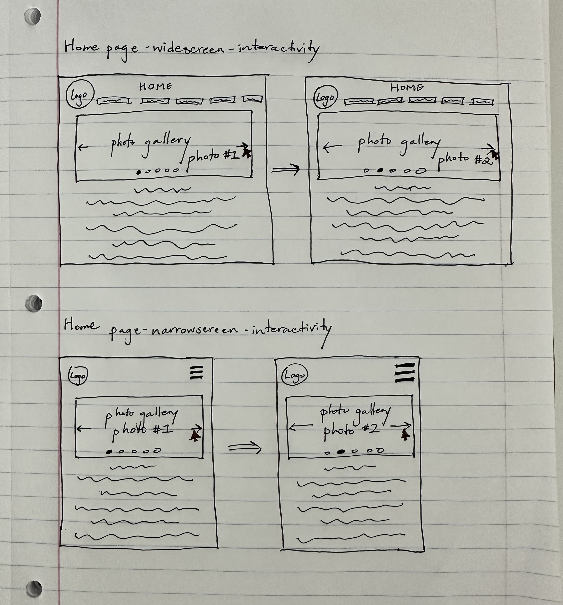
At Home Page we considered to employ a photo gallary. On the wide version, we have a wide photo gallary showing one photo each time, with an arrow pointing to the right and an arrow pointing to the left on each side of the photo. In the sketch we can see that, with the first photo showing on the gallary, if the right arrow is clicked, the second picture will be presented. In addition, a hamburger menu was also employed

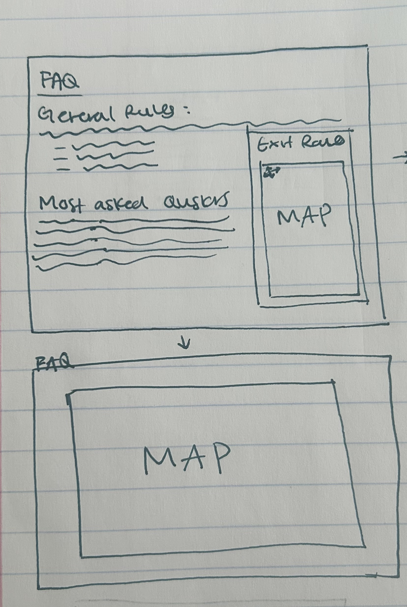
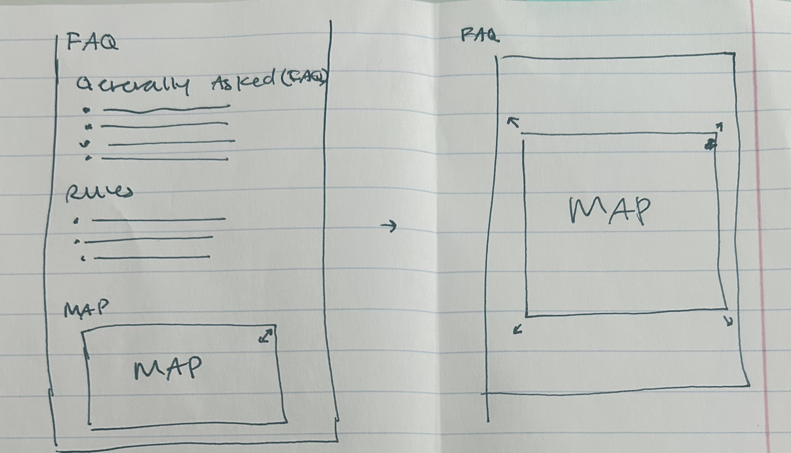

For the FAQ page, we considered to employ a modal. This made it so that whenever the side of the map was clicked, a bigger image of the map would show up. This was cued by hovering on the map where a shadow would show it was interactive. IN the sketch, we see how when the image is clicked, the map gets bigger.

### Final Design (Milestone 2)
> Include the final sketches for each of your pages.
> **Include your final interactivity in your sketches.** Include annotations to explain what happens when the user takes an action with your interactivity.
> The sketches must include enough detail that another 1300 student could implement them.
> Please provide an explanation for each sketch.

**Narrow Design:**

- Home
  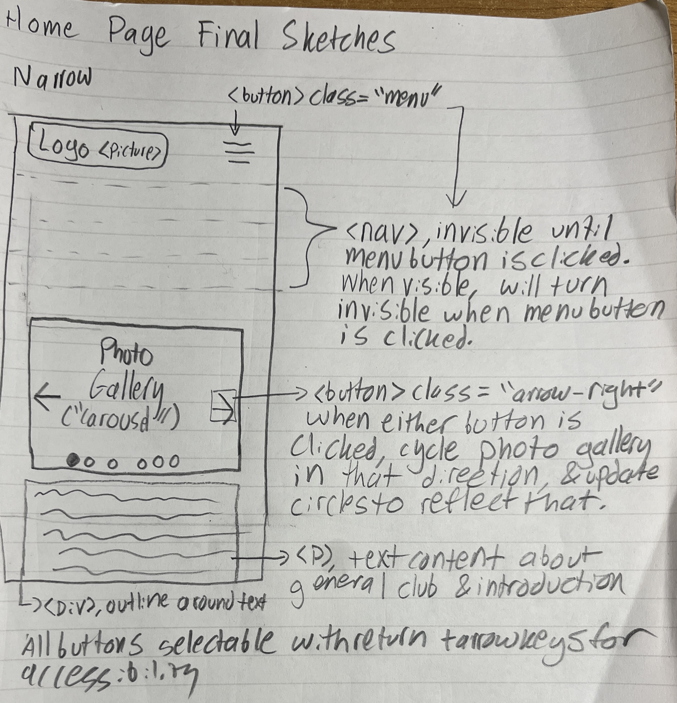
  Explaination: The design for the narrow homepage is straightforward. It employs the classic design principles of vertically orienting content and using a collapsable hamburger menu to make the menu easier to access. The primary content that it houses is a photo gallery and some text content giving a high level overview of what CCC is.

- FAQ
  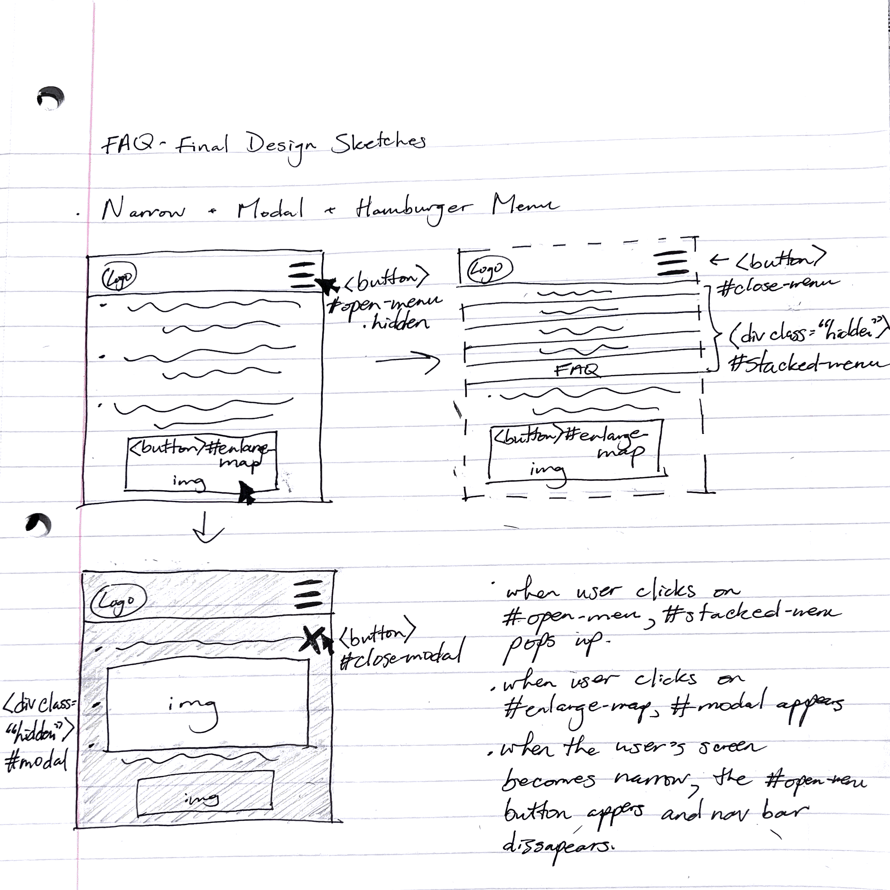
  Explaination: *annotations within sketch

- Past events
  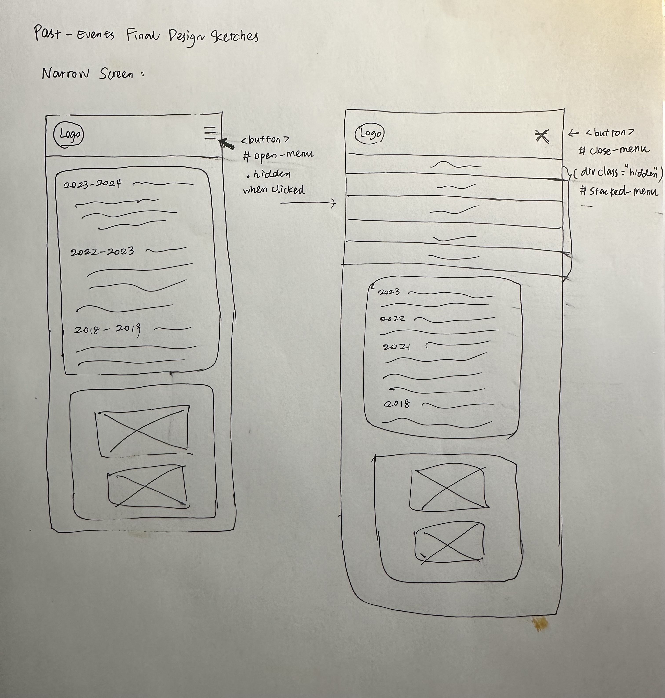
  Explaination: The design for the narrow screen employs the classic design pattern of a collapsable hamburger menu to make the menu easier to access. In narrow screen, the contents are vertically organized.

- E-Board
  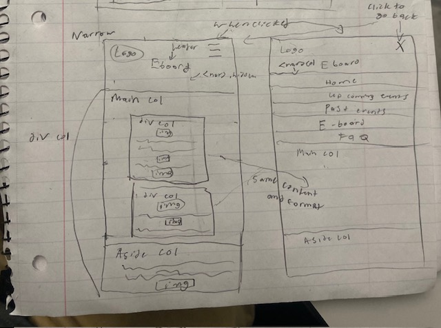

  Explaination: The design for the narrow screen employs the familar design pattern of a collapsable hamburger menu to make the menu easier to access. In the narrow screen my contents are now organized vertically to better support narrow screens design patterns.

- Upcoming Events
  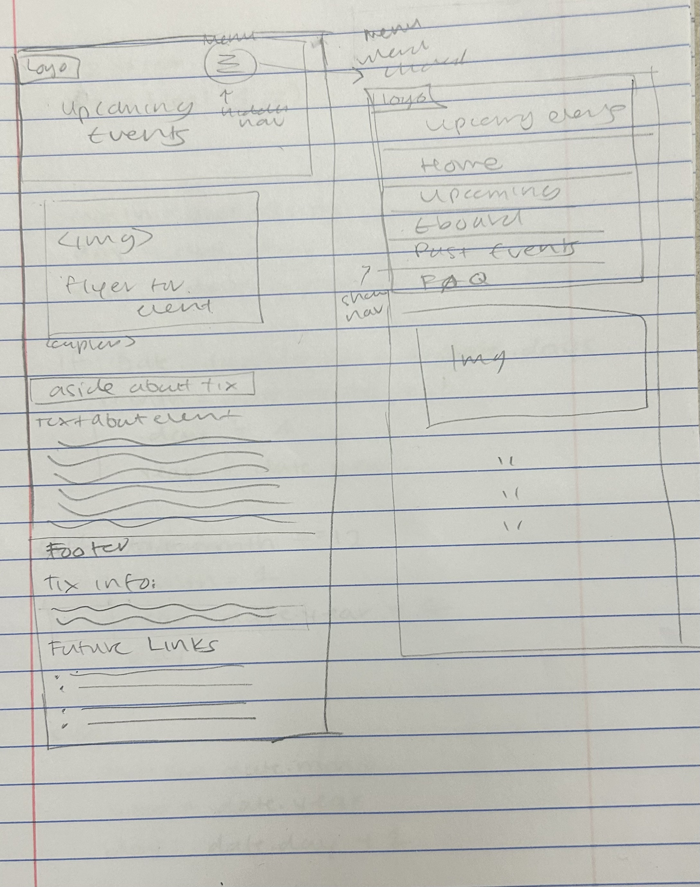

  Explaination: The design for the narrow screen employs the usual hamburger menu for accessibility purposes. In the narrow screen, content is much bigger and stacked, per the usual design pattern

**Wide Design:**

- Home
  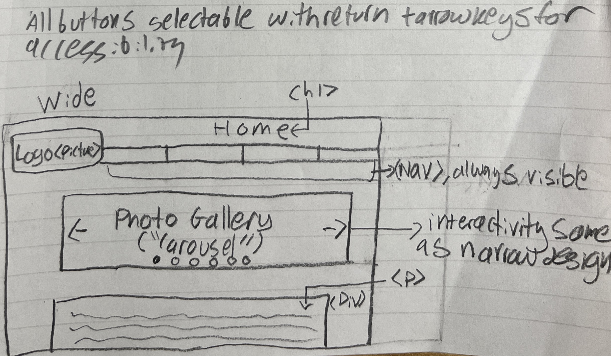
  Explaination: The design for the wide homepage is still vertical to preserve the readability and flow of the page as well as the emphasis on the image carousel. It has no hamburger menu and horizontally orients the navigation menu. It stores the same text and image content as the narrow design, and has the name of the page up at the top.

- FAQ
  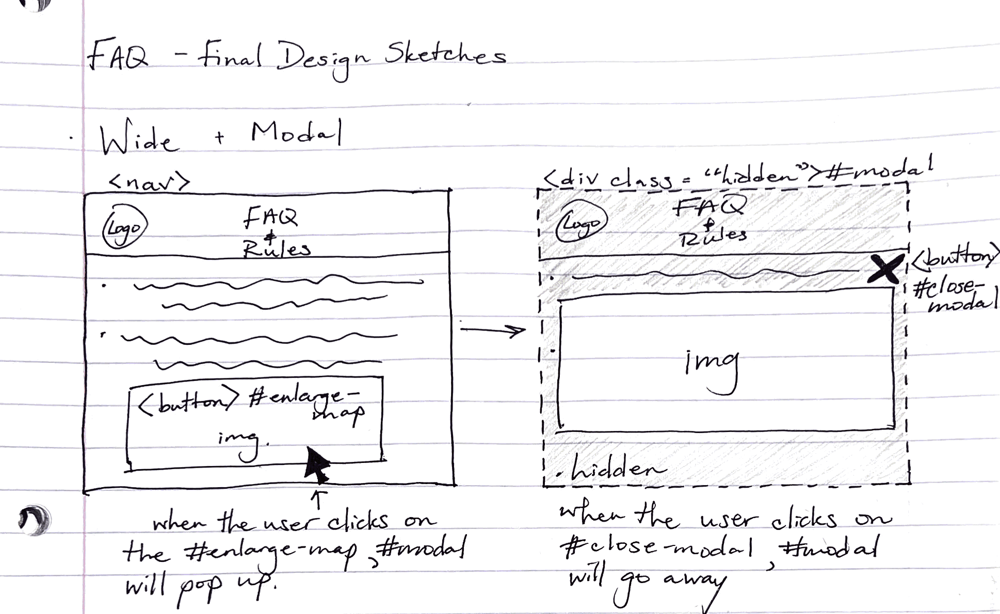
  Explaination: *annotations within sketch

- Past events
  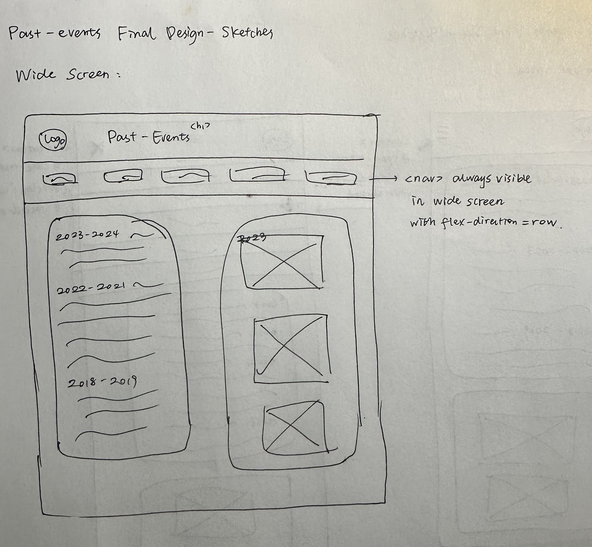
  Explaination: In wide screens, the hamburger menu becomes horizontal navigation bar showing up all the time. The content and the pictures are organized horizontally, with the main content on the left and photos in the sidebar on the right.

- E-Board

  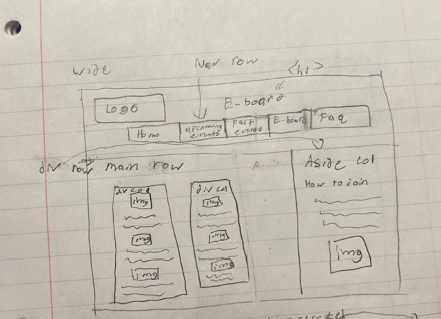

  Explaination: In the wide screen, the hamburger menu becomes horizontal navigation bar which is present at all times. The content is now organized more horizontally. I employ the use of a sidebar on the right of my page and the main content on the left.

- Upcoming Events

  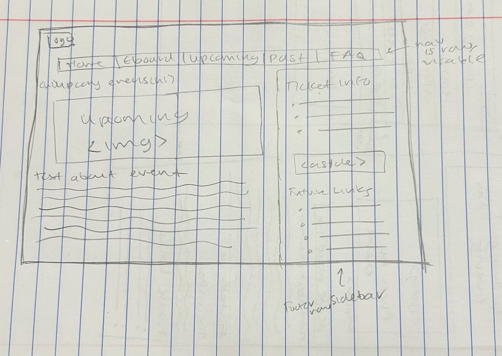

  Explaination: The hamburger menu turns into a horizontal nav bar that is now visible at all times. the footer in the narrow view is now a side bar on the right side of the page, making content easily accessible with minimal scrolling.

### Design Rationale (Milestone 2)
> Explain why your design is appropriate for your audience.
> Specifically, why does your content organization, navigation, and site design/layout meet the goals of your users?
> How did you employ **design patterns** to improve the familiarity of the site for your audience?

This website's deisng is appropriate for my audience. The content organization makes sense for our audience as it groups all relevent information together and makes it so that they can access all necessary information on the go. The home page mostly serves to meet the second goal of gaining knowledge about CCC. The home page of any site also serves the purpose of captivating the audience's attention within 10 seconds by giving a quick, visceral introduction to the site. This page quickly grabs user's attention with flashy pictures from shows, and also houses the most broad strokes, general information about the club, which will control the user's expectations and perceptions for traversing the rest of the site if they wish. This general info is also the "if you don't learn anything else, learn this" info for this site, which is appropriate as it will be the first thing people see. The upcoming events page allows for users to see upcoming events from the CCC. It is filled with bright colors and generates excitement for upcoming events. The design makes information easily accessible and of a familiar style. The design of the FAQ page enhances the site's functionality by making it easier for users to find the information they are looking for and to plan accordingly to the rules for their concert. The past events page employed common design pattern including hamburger menu as well as side bar, effectively improved the familarity of the site for my audience. The eboard page provides users with direct pathways to explore the leadership behind the club, fostering a connection between the audience and the organization. In summary, the design choices prioritize user experience, using common desing patterns like sidebar and hamburger menu, making it easy for the audience to navigate, discover, and engage with the content that matters most to them. It offers insight on how to join and the audience gains knowledge about the club which is one of the goals of our audience.

## Interactivity Rationale (Milestone 2)
> Describe the purpose of your proposed interactivity.
> Provide a brief rationale explaining how your proposed interactivity addresses the goals of your site's audience and enhances their user experience.

The map modal on the FAQ page provides a convenient way for users to get a closer look at the location of the concert, providing a convenient way for users to easily find the building.

Also the proposed responsive hamburger menu, adapting to a horizontal navigation bar on wide screens and a collapsed menu on narrow screens, serves to optimize user navigation across various devices. This design choice ensures a clean and intuitive experience, meeting industry standards for usability. By seamlessly adjusting to different screen sizes, the interactivity enhances overall accessibility, aligning with the diverse needs of the site's audience and elevating their browsing experience.

A common confusion among the public regarding CCC is what kind of concerts we offer, as Cornell is more well known for orchestra / cultural events hosted by organizations such as the concert series. The picture slideshow gives users clarity about what kind of concerts CCC hosts, as well as letting users browse images with the arrow buttons. This allows them to either search for artists they know, or just look at many interesting / visually satisfying images. The interactivity allows us to show off the diversity in the concerts that CCC offers without clogging the page with many different instances of a single image, which would distract the user and make it more difficult to see each image individually or find the text content at the bottom of the page. The carousel allows the images to greet the user front and center, while also creating sufficient room for multiple images. A carousel on the home page is also a common modern design pattern and will impress and satisfy users by meeting expectations.

## Interactivity Plan (Milestone 2)
> Now that you've designed your interactivity for your site, you need to plan how you will implement it.
> Describe how you will implement the interactivity. This should be a complete plan that another 1300 student could use to implement the interactivity.
> You should list the HTML elements, CSS classes, events, pseudocode, and the initial state.

All
Hamburger Menu

- When element button with class menu is clicked:
  - If button has unclicked class:
    - Remove unclicked class from button and add clicked class to it
    - Remove hidden class from nav element
  - Otherwise:
    - Add unclicked class to button and remove clicked class from it
    - Add hidden class to nav element
- When screen is resized to wide
  - Add unclicked class to button and remove clicked class from it
  - Add hidden class to nav element

Home
Carousel

- When left arrow is clicked
  - Decrement id of shown picture by one, increasing from -1 to max index if necessary
  - Make previous circle dark, return next circle to default color
- When right arrow is clicked
  - Increment id of shown picture by one, decreasing from max index +1 to 0 if necessary
  - Make next circle dark, return previous circle to default color

## Client Feedback & Minutes (Milestone 2)
> You should meet with your client again to obtain feedback on your design.
> Provide a summary of the client's feedback and your meeting's minutes.

Client feedback
Client feedback on audience goals

- Sounds very accurate
Client feedback on content / card sorting

- Generally looks good
- Q: Where is "recent show" info?
  - A: It would remain on the "upcoming" page until we had a new show to promote.
Client feedback on design

- Approval

Client feedback on planned page layouts

- Approval

Client Questions / Comments

- Is there a way to deploy the website in a way that is editable by future club members who do not know HTML to edit page content, such as deploying it into the existing Cornell Blogs framework?
  - A: We will look into it.

Meeting minutes
See above. Everything is covered in those questions

## User Testing (Final Submission)

**Conduct user testing with a minimum of 1 participant for every member of your team.**

### User Testing Tasks (Final Submission)
> Plan out your user testing tasks before doing your user testing.
> These must be actual user testing tasks.
> **Tasks are not questions!**

1. Find who is performing the most recent concert and when it is.
2. Find who performed on September 22nd, 2018.
3. Suggest an artist to CCC.
4. Find out how to join CCC.
5. Identify the name of the selections director.
6. Identify what street Bailey hall is on.

### Participant 1 (Final Submission)
> Using your notes from above, describe your user by answering the questions below.

1. Who is your user, e.g., where does the user come from, what is the user's job, characteristics, etc.?

The user is a college student majoring in computer science, enjoys a variety of music genres, and has attended a Cornell Concert Commission event in the past.

1. Does the user belong to your audience of the site?

    > If “No”, what’s your strategy of associating the user test results to your audience’s needs and wants? How can your re-design choices based on the user tests make a better fit for the audience?

    Yes

### Participant 1 -- Testing Notes (Final Submission)
> When conducting user testing, you should take notes during the test.

Task 1: Find who is performing the most recent concert and when it is.

-Participant navigated to the "Upcoming Events" section.
-Identified the most recent concert and its performance date.

Task 2: Find who performed on September 22nd, 2018.

Successfully located the event on September 22nd, 2018, and identified the performing artist in the "Past Events" section.

Task 3: Suggest an artist to CCC.

Located the "FAQ" section.
Clicked on the submit artist proposal link

Task 4: Find out how to join CCC.

First navigated to the FAQ page then went to the E-Board Page
Stated that the purple color was hard to see
Successfully found information on the E-Board page

Task 5: Identify the name of the selections director.

Navigated to the "E-Board" section.
Stated that I should add a space between the title and the explination of the role
Identified the name of the selections director.

Task 6: Identify what street Bailey Hall is on.

Went to the "FAQ" section.
Found where Bailey Hall was located by looking at the map

### Participant 2 (Final Submission)
> Using your notes from above, describe your user by answering the questions below.

1. Who is your user, e.g., where does the user come from, what is the user's job, characteristics, etc.?

    She is a graduate student at Cornell who is interested in pop music and enjoys music shows.

2. Does the user belong to your audience of the site?

    > If “No”, what’s your strategy of associating the user test results to your audience’s needs and wants? How can your re-design choices based on the user tests make a better fit for the audience?

    Yes

### Participant 2 -- Testing Notes (Final Submission)
> When conducting user testing, you should take notes during the test.

Task 1: Locate information about the latest concert and its performers.

Participant found the information very quick by clicking the tab in navigation menu.

Task 2: Discover who performed on September 22nd, 2018.

Participant successfully located the event on September 22nd, 2018 in past events page.

Task 3: Recommend an artist to CCC.

Participant navigated to 'FAQ' page and submitted an artist proposal by clicking on the designated link.

Task 4: Learn how to become a member of CCC.

Participant tried to look at 'FAQ' first then navigated to 'E-board' page and found information on how to join CCC.

Task 5: Find out who is the current selections director.

Participant navigated to the "E-Board" section and identified the name of the director.

Task 6: Determine the location of Bailey Hall.

Participant navigated to the "FAQ" section and located Bailey Hall on the map, determining its street location.

### Participant 3 (Final Submission)
> Using your notes from above, describe your user by answering the questions below.

1. Who is your user, e.g., where does the user come from, what is the user's job, characteristics, etc.?

    My user is a Cornell junior majoring in interior design. She likes listening to indie music and sad music.

2. Does the user belong to your audience of the site?

    > If “No”, what’s your strategy of associating the user test results to your audience’s needs and wants? How can your re-design choices based on the user tests make a better fit for the audience?

    Yes

### Participant 3 -- Testing Notes (Final Submission)
> When conducting user testing, you should take notes during the test.

Task 1: Locate information about the latest concert and its performers.

Participant found the information very quick by clicking 'upcoming events' in navigation menu.

Task 2: Discover who performed on September 22nd, 2018.

Participant successfully located the event on September 22nd, 2018 in 'past events' page.

Task 3: Recommend an artist to CCC.

Participant navigated to 'FAQ' page and submitted an artist proposal by clicking on the designated link.

Task 4: Learn how to become a member of CCC.

Participant tried to look at 'FAQ' first then navigated to 'E-board' page and found information on how to join CCC.

Task 5: Find out who is the current selections director.

Participant navigated to the 'E-Board' section and identified the name of the director.

Task 6: Determine the location of Bailey Hall.

Participant navigated to the "FAQ" section and located Bailey Hall on the map.

### Participant 4 (Final Submission)
> Using your notes from above, describe your user by answering the questions below.

1. Who is your user, e.g., where does the user come from, what is the user's job, characteristics, etc.?
  My user is a Senior at cornell who has attended multiple of the club's concerts and knows some of the members.

2. Does the user belong to your audience of the site?
    > If “No”, what’s your strategy of associating the user test results to your audience’s needs and wants? How can your re-design choices based on the user tests make a better fit for the audience?

    Yes

### Participant 4 -- Testing Notes (Final Submission)
> When conducting user testing, you should take notes during the test.

Task 1.

  Participant found the information instantly and needed no help.

Task 2.

  Participant found the information instantly and needed no help.

Task 3.

  Participant found the information instantly and needed no help, though she did comment on the word "here" being unreadable.

Task 4.

  Participant checked "FAQ" and "home" before checking the eboard page. I think it is user error that she missed it on the home page (she scrolled by and didn't read any of the text).

Task 5.

  Participant found the information instantly and needed no help.

Task 6.

  Participant found the information instantly and needed no help.

### Participant 5 (Final Submission)
> Using your notes from above, describe your user by answering the questions below.

1. Who is your user, e.g., where does the user come from, what is the user's job, characteristics, etc.?
  My user is a 21 year old information science major at Cornell

2. Does the user belong to your audience of the site?
 Yes

### Participant 5 -- Testing Notes (Final Submission)
> When conducting user testing, you should take notes during the test.

For Tasks 1, 2, 3, 5, and 6, the user found the information easily with no assistance necessary. For Task 4, the user went to the FAQ page first, then clicked through all the pages until they found the correct information.

## Website Revision Based on User Testing (Final Submission)
> What changes did you make to your design based on user testing?

- Changed color on eboard to make it easier to see
- Changed link styling on FAQ page so that "here" is easier to see.
- Changed FAQ text to make it a bit more clear how to join the club.
- Changed the link color on the FAQ page to make it easier to find
- Changed brightness of upcoming events sidebar to a less sharp color

## Grading (Final Submission)

### Collaborators (Final Submission)
> List any persons you collaborated with on this project.

- Xiaokun Du
- Noah Braun
- Fatou Doaw
- Tami Weng
- Gregorio Sanchez Casella

### Reference Resources (Final Submission)
> Please cite any external resources you referenced in the creation of your project.
> (i.e. tutorials, W3Schools, StackOverflow, Mozilla, etc.)

W3Schools, Mozilla and StackOverflow
