# Project 1: Design Journey

**For each milestone, complete only the sections that are labeled with that milestone.** Refine all sections before the final submission.

You are graded on your design process. If you later need to update your plan, **do not delete the original plan, leave it in place and append your new plan _below_ the original.** Then explain why you are changing your plan. Any time you update your plan, you're documenting your design process!

**Replace ALL _TODOs_ with your work.** (There should be no TODOs in the final submission.)

Be clear and concise in your writing. Bullets points are encouraged.

**Everything, including images, must be visible in _Markdown: Open Preview_.** If it's not visible in the Markdown preview, then we can't grade it. We also can't give you partial credit either. **Please make sure your design journey should is easy to read for the grader;** in Markdown preview the question _and_ answer should have a blank line between them.

## Personal Site (Milestone 1)

### Website Topic (Milestone 1)

> Briefly explain what your website will be about. Share your vision of your personal website.

My website will be about my personal information, hobbies, and interests.

## Personal Website Design Exploration (Milestone 1)

Identify three personal websites (preferably static websites) that exist today on the web. You will be drawing inspiration from these sites for your own site; please select websites that are similar to the website you wish to create.

Include a screenshot of the home page for each site. If you're planning a mobile website, your screenshots should be from a mobile website. If you're planning a desktop website, your screenshots should be from a desktop website.

**We'll refer to these are your "example websites."**

1. <https://zhang.ece.cornell.edu>
   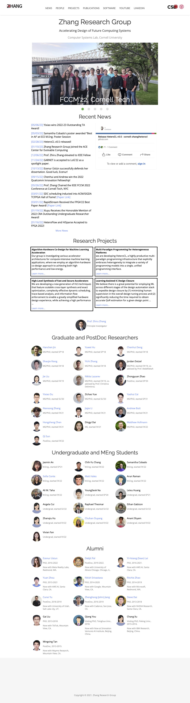

2. <https://www.iamtamara.design>

   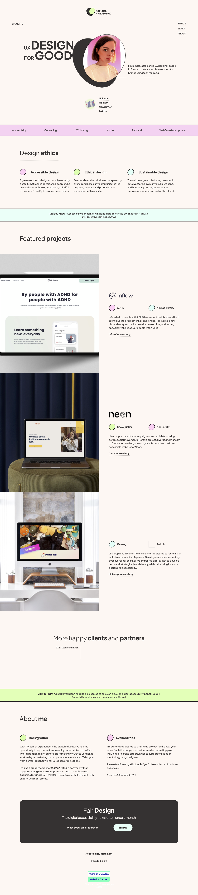

3. <https://rwt.io>

   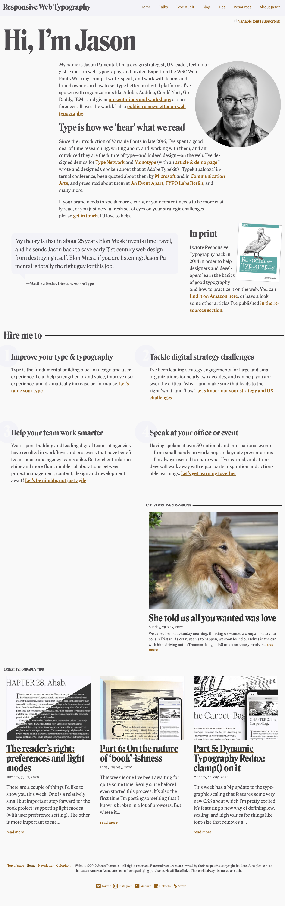

### Personal Website 1 Review (Milestone 1)

> Review the personal website you identified above. (1-2 paragraphs)
>
> - Who do you think this site is designed for? Who is its intended audience?
> - What **goals** do you think the audience likely has when visiting this site.
> - What **content** is included?
> - Do you believe the content likely **addresses** the goals of the site's audience?
> - What do you like about the design?
> - Is the site designed for desktop, mobile, or desktop and mobile devices?

For the website 1 from Prof Zhang, I think it is designed for individuals in the **academic and research** community, particularly those interested in electrical and computer engineering. Its intended audience may include **those who interested in Dr. Zhang's research**, **students** seeking research oppotunities, and **fellow academics** looking to engage with his work. Audience to the site are likely wanting to explore his **research projects**, **access publications**, and potentially **collaborate** on research endeavors.

The website includes a variety of content such as **research project descriptions, publications, teaching resources, and information about Prof Zhang's lab**. I think the content is well-aligned with the goals of the audience, providing comprehensive insights into his research area and offering resources for students and fellow researchers. The design of the website is **professional** and **organized**, allowing visitors to easily navigate and access the different sections with the navigation bar. In addition, there is also an **embedded twitter profile** which is perfect for audience who wants to get the latest news about his research group. While primarily designed for desktop users, the site maintains functionality on mobile devices, while some part of the design still need to be resized (such as logos at the navigation bar).

### Personal Website 2 Review (Milestone 1)

> Review the personal website you identified above. (1-2 paragraphs)
>
> - Who do you think this site is designed for? Who is its intended audience?
> - What **goals** do you think the audience likely has when visiting this site.
> - What **content** is included?
> - Do you believe the content likely **addresses** the goals of the site's audience?
> - What do you like about the design?
> - Is the site designed for desktop, mobile, or desktop and mobile devices?

For the website 2 from **Tamara Sredojevic**, I think it is designed for indivisuals interested in **UX design**, particularly those intrigued by **ethical design**, **accessibility**, and **inclusion**. So the targeted audiance could be **UX designers**, **design enthusiasts**, and **professionals** seeking insights into **ethical** and **inclusive** design practices. The audience to this website may want to learn about **Tamara's approach to UX design** and her **emphasis on ethical considerations**.

The site's content includes details about Tamara's **work**, her **philosophy of design**, and her **passion for ethical and accessible design**. As an advocate for these principles, the content effectively addresses the goals of visitors who are looking to better understand and integrate ethical design into their own practices. The design of the website is **harmonic** with the use of **large shapes, delicate lines**, and **muted colors**, giving a warm and balanced user experience. I like the design of the profile photo which becomes reversed every time when scrolling the webpage. The site is perfectly designed for **both desktop and mobile devices**.

### Personal Website 3 Review (Milestone 1)

> Review the personal website you identified above. (1-2 paragraphs)
>
> - Who do you think this site is designed for? Who is its intended audience?
> - What **goals** do you think the audience likely has when visiting this site.
> - What **content** is included?
> - Do you believe the content likely **addresses** the goals of the site's audience?
> - What do you like about the design?
> - Is the site designed for desktop, mobile, or desktop and mobile devices?

For the website 3 from **Jason Pamental**, I think it is designed for designers, developers, and typography enthusiasts. The intended audience likely includes professionals who want to get some insights into **typography**, **web design**, and **digital experiences**. Visitors may aim to enhance their understanding of **typographic principles**, learn about **innovative web design techniques**, and **access valuable resources** for improving their design projects.

The site's content includes articles and presentations on **responsive typography, web design, and variable fonts**. It also features **case studies, speaking engagements, and consulting services**. The content addresses the goals of its audience, offering related knowledge and insights that they can apply to their own design endeavors. It is visually appealing, and the layout is **organized and user-friendly**. The typography is thoughtfully presented which aligns well with the site's focus. This site is perfectly designed for **both desktop and mobile devices**.

## Audience & Goals (Milestone 1)

Using what you learned from studying the example websites, identify your website's audience and their goals.

### Audience (Milestone 1)

> Briefly explain who the intended audience is for your website. Be specific and justify why this audience is appropriate for your site's topic.

The intended audience for my personal website is my university classmates within my department (engineering department). These are individuals who are interested in collaborating with me on course projects, studying together, and getting to know each other better. They share the common goals of improving academic performance, doing better group work, and building connections within the university community.

This audience is appropriate for my website, as I will contain my basic information, contact information, hobbies, class schedule and my previous engineering projects in my website, which could be very useful for my classmates who are also doing engineering to know, and may lead to a further friendship, a meeting schedule in groupwork or a cooperation in any engineering project.

### Audience Goals (Milestone 1)

> Why would your audience visit your site?
> Identify at least 3 goals that your users have for visiting your website.

1. Contact Information Access: Peers and classmates can easily find all my contact details, making it simpler to reach out for collaborative purposes or casual interactions.

2. Schedule Checking: Students in my classes can quickly reference my schedule to plan study sessions or group meetings, enhancing teamwork and collaboration.

3. Get Shared Interests: Visitors can explore my hobbies and interests like music or football, potentially leading to conversations and connections over common activities.

## Content Planning (Milestone 1)

Plan your site's content.

### Your Site's Planned Content (Milestone 1)

> List **all** the content you plan to include your personal website.
> You should list all types of content you planned to include (i.e. text, photos, images, etc.)

- Homepage: a photo of myself on home page
- Homepage: a paragraph of my basic information and welcome
- Homepage: my contact information
- Homepage: my social media information
- Homepage: an image/table of my current class schedule
- About me page: my personal information (name, date of birth, hometown...)
- About me page: a list of my hobbies
- About me page: fun facts of me
- Hobbies page: descriptions about my interest in music
- Hobbies page: photos of my piano and guitar with me (as a part of my hobby)
- Hobbies page: description about my love to football
- Hobbies page: photos of me and football games
- Hobbies page: description about my travellings
- Hobbies page: screenshot of the places i've been to on the map
- Academic project page: descriptions of the cool engineering projects that I've done
- Academic project page: photos of the cool engineering projects that I've done
- Photos page: descriptions of the photos that I've taken
- Photos page: photos I've taken before

### Content Justification (Milestone 1)

> Explain (about a paragraph) why this content is the right content for your site's audience and how the content addresses their goals.

The photo of myself and personal information at homepage help my audience put a face to the name and facilitate contact immediately they open the webpage. My academic information and class schedule at homepage will be helpful when my audience wants to collaborate with me, enabling effective schedule of group study and project meetings. The about-me page could be a useful section for my peers who want to know more about me and make friends with me. Descriptions of my photography hobby, music interests and football interests give insight into shared hobbies and potential topics for conversation and connection. And they might find something interest them in my engineering projects as they may also be in a engineering major and they may want to connect with me on academic projects. The final photo page could be a useful page for both sharing the photos I've taken as my hobby, as well as sharing more information about my personal life, which my peers might be interested in.

### Home Page Content (Milestone 1)

> What is the content that your users would expect when visiting your site for the first time.
>
> Briefly identify what content you will include on the homepage and why this content should be the first thing your target audience sees when they visit your site.

The homepage will prominently feature my photo, a brief self-introduction paragraph with my major and my contact information. This content is crucial as it provides a quick overview of who I am and what I'm involved in, and help them to get connect with me quickly. Additionally, the homepage will include my class schedule for the reference. This ensures that when my peers open my website, they have instant access to key information for coordination and collaboration. The homepage content directly addresses my audience's goals by facilitating quick connections and collaborative interactions. Finally there would be my social media accounts, as our peer university students use social media heavily and may want to connect with me on Instagram immediately, or looking more content about me on my social media accounts.

## Information Architecture (Milestone 2)

For milestone 2, you will design the information architecture for all the pages your website.

You may change your homepage content based on your card sorting. If you do change the homepage content, don't update it above, just include the new plan in the section below (Content Organization).

### Content Organization (Milestone 2)

> Document your **iterations** of card sorting here. You must have at least 2 iterations of card sorting.
> Include photographic evidence of each iteration of card sorting **and** description of your thought process for each iteration.
> Please physically sort cards; please don't try and do this digitally.

#### 1st iteration

- first iterations:

   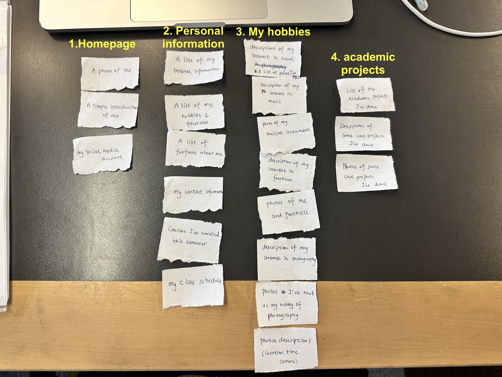

- Explainations of the first:

   I've divided them into **four pages** which are **Homepage, Personal Information, My hobbies** and **Academic projects**.

   In this iteration, my **contact information**, **the courses I'm taking** and **class schedule** were put into the 'Personal Information' page, while the **photos** I've taken while travelling with their descriptions were put into the 'My hobbies' page.

   I divided them like this according to their **relevence** to each category, and each page is a distinct aspect of me, which could be more **logically organized**.

- second iterations:

   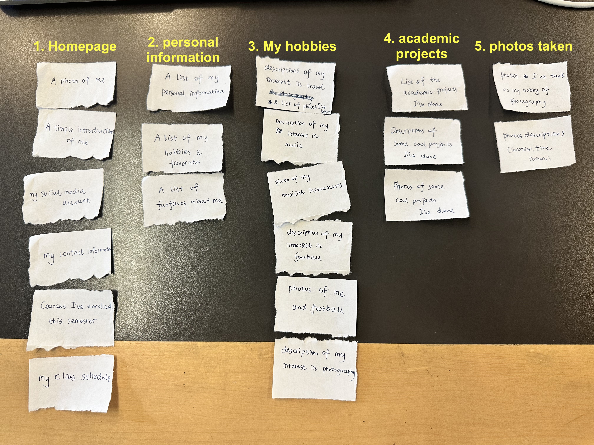

- Explainations of the second:

   In this iteration, I've divided them into **five pages** which are **Homepage, Personal Information, My hobbies, Academic projects** and **Photos**.

   In addition, my **contact information**, **the courses I'm taking** and **class schedule**  were put into the 'Homepage' page instead, and the **photos** I've taken while travelling with their descriptions were took out from hobbies page into a new page called **Photos**.

   I divided them in this way compared to the first iteration, because I am **prioritizing the need and experience** of the **audience**. Firstly, as my audience are my classmates in engineering department, they may firstly want to get my contact information as well as my timetable immediatley when visiting my website, as they may want to schedule some meeting with me regrading to some coursework. So I chose to put **contact information** and **class schedule** to the homepage. Secondly, when my audience exploring my hobbies, they may not want to be interrupted by loads of the photos I've taken, but may want to get an overview with all my hobbies. That's the reason why I chose to put **photos** to a seperate page.

### Final Content Organization (Milestone 2)

> Which iteration of card sorting will you use for your website?

I will use the 2nd iteration one.

> Explain how the final organization of content is appropriate for your site's audiences.

1. Prioritizing Audience Needs

   The final organization reflects a consideration for the immediate needs of my audience (my engineering classmates). Placing my contact information and class schedule on the homepage addresses their potential requirements for scheduling meetings or coursework-related inquiries, which makes it more convenient for them to access vital information quickly.

2. Clearly Organized

   The final organization contains five pages, which are Homepage, Personal Information, My hobbies, Academic projects and Photos. This is  clearly organized with those five distinct aspect.

3. Align with Audience Interest

   For the final organization, every one of the five aspects (pages) could interest my audience, who are my classmates in the engineering department, to know more about me as well as connect with me on departmental projects.

4. Enhanced User Experience

   By distributing content across multiple pages, it enhances the overall user experience. Audience can navigate more easily to the specific information they are interested in without having to scroll through lengthy pages. This segmentation allows for more focused exploration of my personal information, hobbies, academic projects, and photos.

   In addition, for example, moving the photos from the "My Hobbies" page to a dedicated "Photos" page ensures that visitors can explore my hobbies without being overwhelmed by a large number of photos, which provides a better user experience.

### Navigation (Milestone 2)

> Please list the pages you will include in your website's navigation.

- Homepage
- About Me
- Hobbies
- Academic Projects
- Photos

> Explain why the names of these pages make sense for your site's audience.

- Homepage:

   Provides a starting point and may include essential information like contact details and class schedule, catering to classmates' immediate needs.

- About Me:

   Offers insights into my personal information and background, which my classmates may be interested in.

- My Hobbies:

   Clearly indicates the page's content and allows classmates to explore my interests.

- Academic Projects:

   Highlights my engineering-related work, which is directly relevant to my classmates' academic interests.

- Photos:

   A straightforward name for a page dedicated to my travel photos, ensuring easy access for those interested in my photography hobby.

## Visual Themes (Milestone 3)

**Make the case for your decisions using concepts from class, as well as other design principles, theories, examples, and cases from outside of class.**

Remember to focus on the things we can't see just by looking at the site: changes, alternatives considered, processes, and justifications.

Each section is probably around 1 reasonably sized paragraph (2-4 sentences).

### Theme Ideas (Milestone 3)

> Discuss several (more than two) ideas about styling your site's theme. Explain why the theme ideas are appropriate for your target audiences.

#### Theme Idea 1: Professional

- Color - Using a simple color scheme with less colors, focusing on neutrals like grayscale for a clean aesthetic. For example, use light grey as background color and black as text color.
- Shape - Using clean, geometric shapes, with the edges of boarders always to be sharp to convey a sense of professionalism.
- Typography - Using a classic, serif font for headings and sans-serif for body text.
- Imagery - Avoid using fun or complex or vibrant decorative images. Use minimalistic and high-contrast images of my academic projects, timetables and so on.

Why: The professional theme aligns with the academic and serious nature of our engineering field, with my engineering classmates audience. This color scheme creates a clean aesthetic that is often associated with professionalism. The typography, with classic serif fonts for headings and sans-serif for body text, could provide clarity and readability, and have a very professional appearance, which is good for the part of my audience who are looking for potential cooperation oppotunities on academic projects with me.

#### Theme Idea 2:  Vibrant

- Color - Using a bold and vibrant color scheme, like red or orange as background color, with light white text color. This could effectively interest my audience (my peers) and give them a welcoming and energetic feeling.
- Shape - Using sharper shapes for the edges of boarders to attract attention from audience.
- Typography - Select a very fun and expressive font like "Baloo" for headings to convey personality. For body text, stick to legible fonts like "Open Sans."
- Imagery - Using many vibrant icons, stickers or logos to decorate the website. Using colorful and lively images including illustrations or vibrant photographs about my passions and experiences.

Why: The vibrant theme gives a feeling of energy and enthusiasm. The bold and lively color scheme cathes attention and creates a welcoming and energetic atmosphere. The use of sharper shapes for borders adds a dynamic edge to the design, making it visually engaging. Typography conveys strong personality which is good for my informal personal website. Colorful and fun images creates an appealing and visually stimulating website for my energetic peer audience.

#### Theme Idea 3: Clean

- Color - Using a clean, simple and cold color scheme, for example, light grey for background, with subtle use of blue for decorative borders.
- Shape - Using rounded corners and playful design elements in borders, some of the borders could be dashed line.
- Typography - Using casual and playful font for title like "Comic Sans MS", and keep everything very easy to read at the same time.
- Imagery - Using some rounded plane icon images for decorative purpose, and using mostly cold and simple color images to keep the website in the same cold color tone.

Why:
The simple color choice conveys a clean and neutral look suitable for an engineering students audience. The rounded design in boarders add a friendly and informal feel to the site, which could be suitable for my audience who are my peers. The font choice gives a playful and casual vibe, at the same time, be very easy to read so ensure my audience could also get access to the important information quickly and easily. The use of decorative icon images add a fun and informal touch to the visual design, which will be attractive for my peers, and keep the whole imagery tone aligning with the website color to give a neater and better user visual experience.

### Final Theme (Milestone 3)

> Which theme did you select as your final theme? Why?

I chose Theme Idea 3. The reasons are:

- Theme 1 could be comparably too formal or too dull for my peers. I think my website should be a interesting place for my peers, and the normal design won't really effectively interest them.
- Theme 2 might be too colorful with too strong personal design, which could be not clear enough for the audience who wanting to find important information (like checking my timetable setting up group meeting with me).
- Theme 3 with calm color and a bit playful design, could not only be very easy to read and navigate for the audience to get important information easily, but also be casual and fun to interest my peers.

### Theme Rationale (Milestone 3)

> Discuss your final theme design: how do they fit your overall design goals and audiences?

My overall design goal for the audience is that I want to provide a friendly and relaxed website introducing myself to the classmates who want to know me, at the same time, to be simple, staightforward and relatively professional for them who want to connect with me on group meetings or on academic projects. Here's how my design align with my goal:

- The simple and clear color scheme, with light gray and a bit of blue, gives a peaceful and neutral background. This makes sure the website is not hard to read and move around, which is important for folks looking for important stuff like timetables and contact details.
- While making it easy to read, the rounded edges add a feeling of being friendly and relaxed to the website. This strikes a balance between the formal academic setting and a more easygoing and engaging user experience, which would be suitable for my engineering classmates.
- The dashed line used at boarder bring more fun and friendly environment to my audience.
- The choice of font is a bit casual and playful, but still letting the essential details come across in a friendly way.
- The use of decorative icon images and simple-color images makes the design appealing, engaging and fun without overwhelming the eyes.

> Emotion is a big part of design. What emotions were you thinking about or trying to convey in your designs?

In making this theme, my aim was to express feelings of being friendly, approachable, and calming to my peers. Here's how these emotions are showing in the design:

- Friendly: The overall design is playful and simple to follow. The playful parts and casual font give off a sense of friendliness, making visitors feel welcome and comfortable while exploring the site.
- Approachable: The rounded edges and a warm color scheme create a welcoming environment. This encourages my audience to interact with the content and connect with me on a personal level.
- Calm: The theme gives a calm feeling with colde colors. The clean lines make sure that important stuff, like my class schedule and contact details, are clear and bringing calm feelings.

## Composition (Final Submission)

### Home Page Composition (Final Submission)

> Include at least two sketches of possible composition ideas for the home page.
> Provide an explanation for each sketch explaining the idea.
> Show your design process.
> **Use the example websites above as inspiration for your site's design.**

- first iteration:
   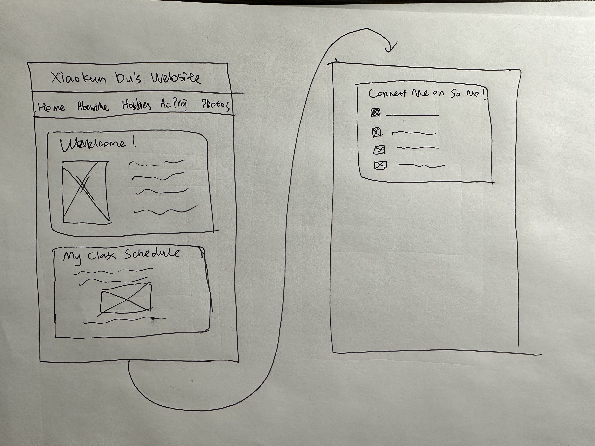
  
  Explaination:
  
  In the first iteration result, I put the website header (Xiaokun Du's Website) on top of the navigation bar as well as the whole webpage content, to make it clear for the audience to know which website they're visiting. For the navigation bar, I chose the horizontal way of build, to give a quick overview of what will be the whole webpage's content. I divided the content into three blocks, with each of them surrounded by the border, to be clear for the audience to understand the structure. 

- second iteration:
   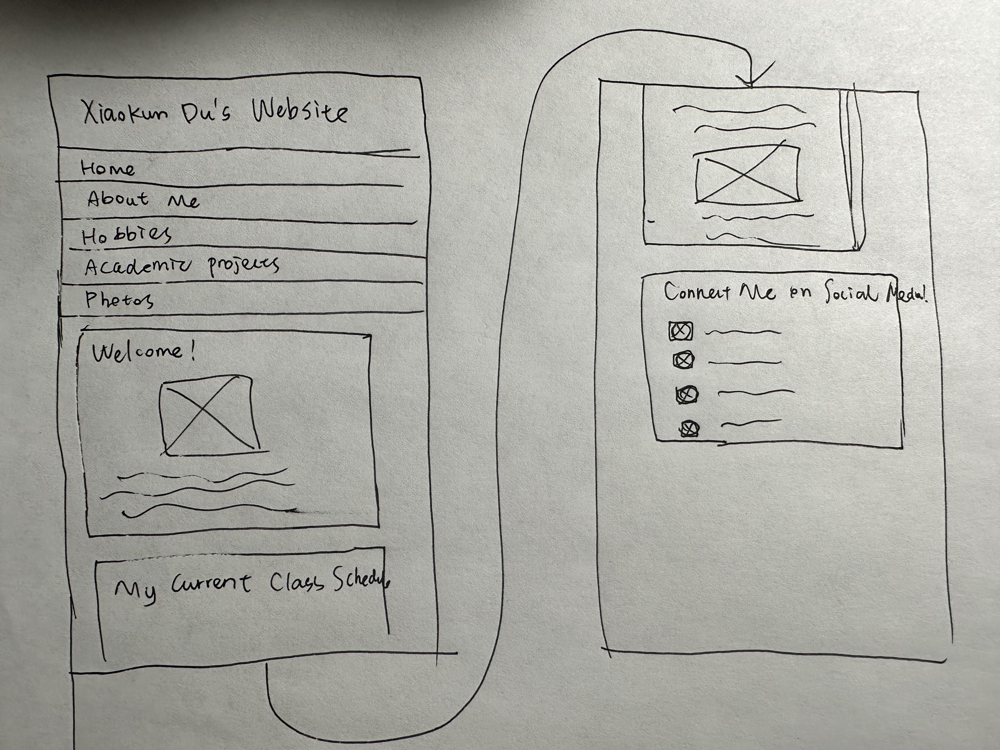
  
  Explaination:

  In the second iteration, compared to the first one, I changed the navigation bar from horizontal to vertical, as we are aming to design for the mobile devices, which may not have enough room for the horizontal navigation bar, and might lead to difficulties in selecting the navigation item. Secondly, I changed the layout in the first welcome block from paralleling figure and text, to let them be at top and down. This is also due to the consideration that on a mobilel device that is not wide enough, it could be difficult for the text content having enough room to display well for the audience.
  

### Final Site Design (Final Submission)

> Include a sketch of the final composition for each page in your site.
> Provide an explanation below each sketch.

Homepage:

About Me:
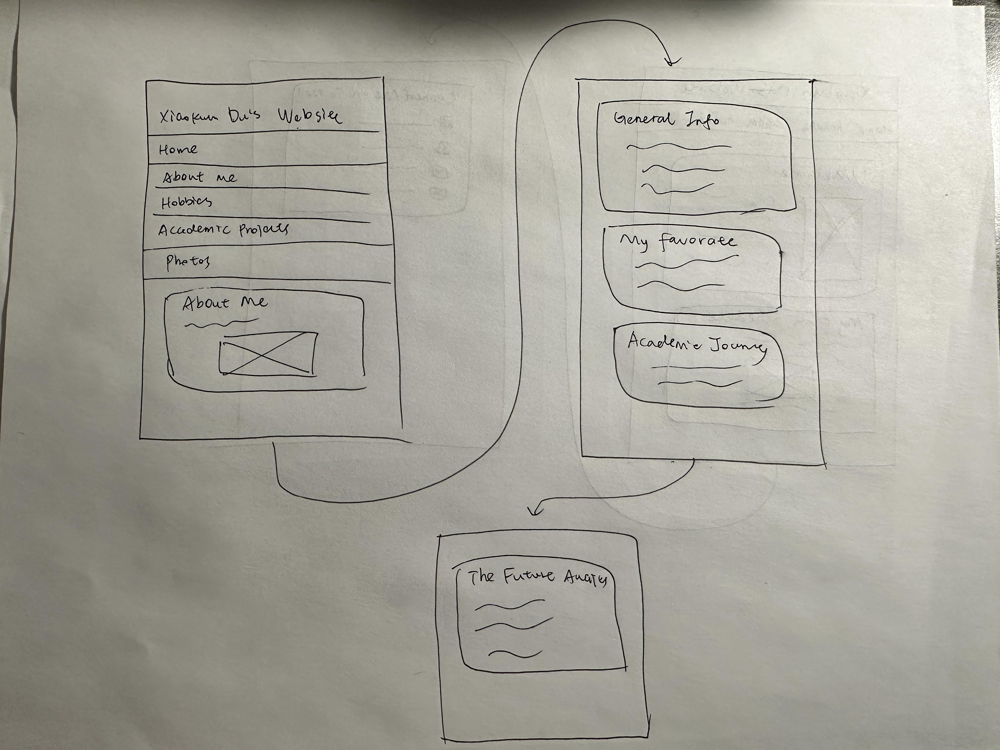

Hobbies:
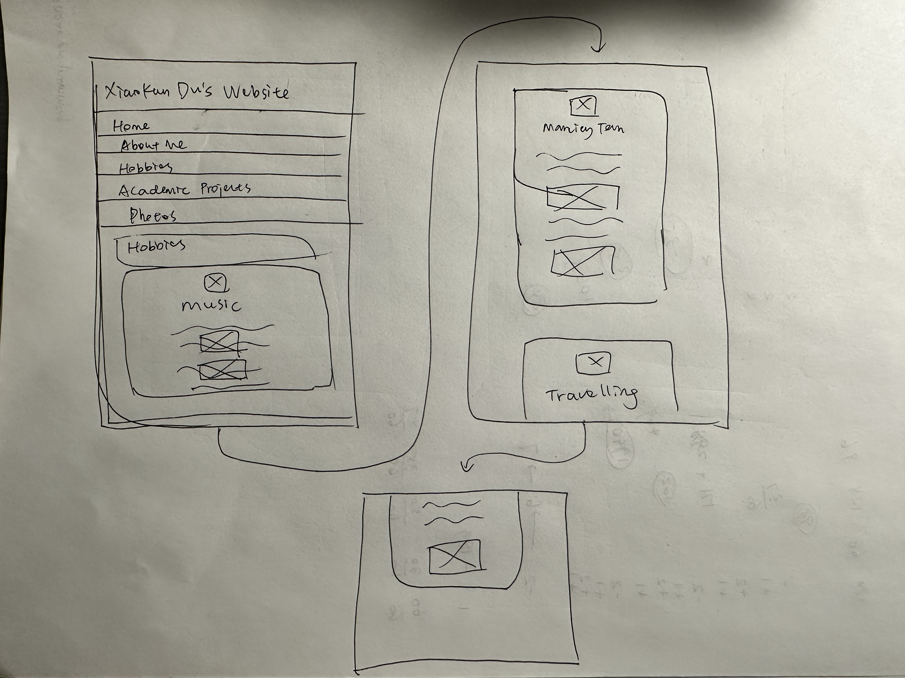

Academic project:
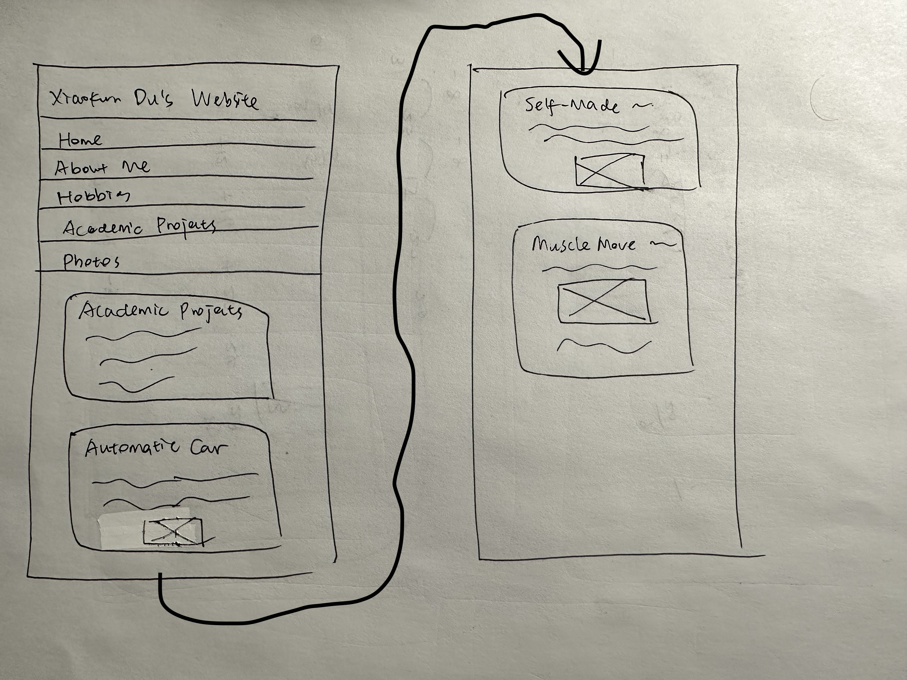

Photos:
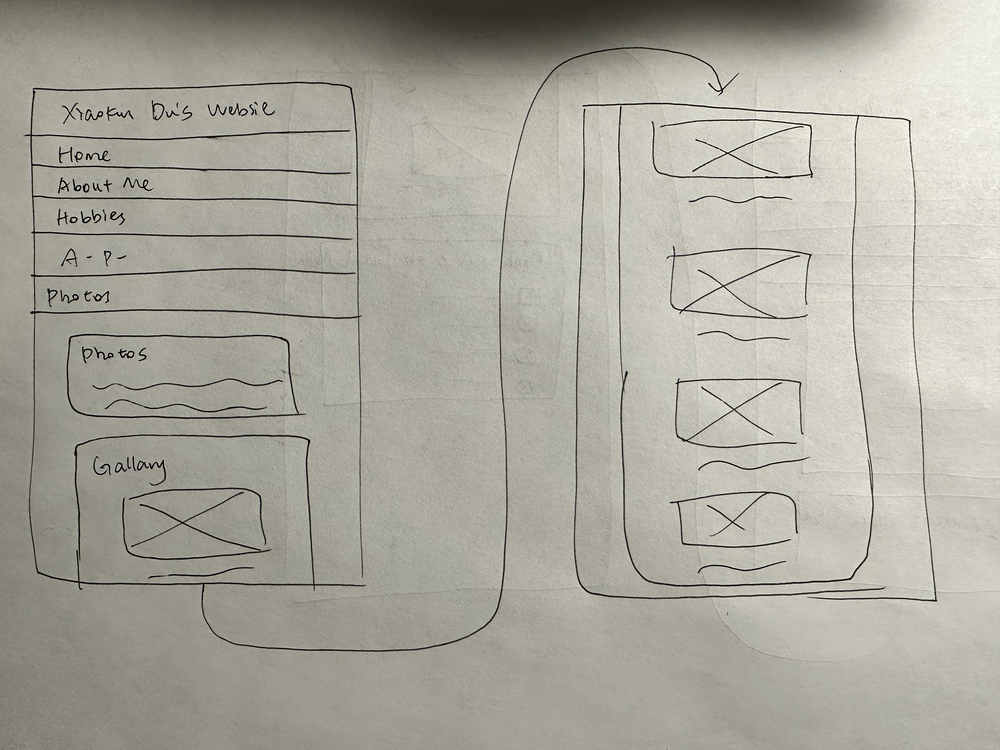

### Static Website Design Check (Final Submission)

> We're building a static website without interactivity.
> **No part of your website may dynamically change.**
> Examples of dynamic behavior are dropdown menus, hamburger menus, popups, modals/lightboxes, image carousels, etc.
> dfd
> Audit your design and check that you aren't relying on any dynamic features.

My website is completely static, as in my design, I didn't use any features such as dropdown menus, hamburger menus, popups, modals/lightboxes, image carousels, and there's no interactive or dynamic features. I have double-checked my CSS code and maked sure they are all static.

## Rationale (Final Submission)

**This rationale should be polished writing:** one you might submit as a report to a client or boss to help explain the project and convince them you did a good job. You'll be surprised how much writing and communicating you need to do about projects and choices on internships and jobs; practice that here.

It should be a comprehensive, complete story of the project. You might find that each section runs a few paragraphs (1-2). Sketches can often help tell the story of your design. Screenshots are also useful for describing issues discovered during the design process and how you addressed them.

**All images must be visible in "Markdown: Open Preview" for credit!**

Your rationale should be a polished version of the earlier explanations.

### Audience (Final Submission)

> A complete and polished description of the intended audience(s) for your website.

My personal website is primarily designed for my university classmates within the engineering department. These individuals are my peers, and the intended audience for my website. They may visit the website for looking up my personal information and contact information, scheduling a potential team meeting, making friends or finding potential corporation in academic projects. They share a common background and context, making them highly relevant to the content and purpose of my website.

### Design Goals (Final Submission)

> An explanation of the design goals for that audience, based on your earlier rationales.

The design goals for my personal website are rooted in meeting the needs of my intended audience:

- Facilitate Quick Connections:
  One of the primary goals is to make it easy for my engineering classmates to connect with me. To achieve this, I aimed to provide quick access to essential information like my contact details and class schedule right on the homepage.

- User-Friendly Navigation:
  The design should prioritize user-friendliness. As my classmates might visit my website on mobile devices, it's crucial to ensure a user-friendly and straightforward navigation experience. The content organization and navigation menu are structured to enhance usability.
  
- Convey Friendliness and Approachability:
  While maintaining a level of professionalism for academic interactions, I also wanted my website to convey friendliness and approachability. This is evident in the use of rounded edges, playful design elements, and casual typography.
  

### Content Organization & Navigation (Final Submission)

> An explanation of how the final content organization and navigation met your goals and why it's appropriate for your audience.

The final content organization and navigation of my personal website represent a thoughtful and deliberate approach to meet the specific goals and preferences of my target audience—my engineering classmates.

The journey of refining content organization began with card sorting exercises. These iterations allowed me to envision how my audience might expect to navigate the website. In the first iteration, I initially categorized content into four sections: Homepage, Personal Information, My Hobbies, and Academic Projects. While this seemed logical at the time, feedback from the second iteration revealed the need to introduce a dedicated "Photos" section, separating my travel photos from the broader category of hobbies. This change responded directly to the user's perspective: the ability to explore travel photos without the distraction of other hobbies.

In the final organization, the homepage emerged as a central hub, prioritizing immediate access to critical information. It includes contact details, class schedules, and a welcome message, all crucial for my classmates looking to connect or coordinate for coursework. The homepage also serves as an introduction, anchoring the visitor's experience.

The subsequent pages—About Me, Hobbies, Academic Projects, and Photos—were carefully designed to offer a deeper insight into different facets of my life. The "About Me" section provides personal information, fostering a sense of connection and familiarity. "Hobbies" shares my interests, potentially igniting conversations about shared passions. "Academic Projects" showcases my engineering work, providing a platform for professional interactions and collaborations. Finally, "Photos" allows for a visually engaging exploration of my travel experiences.

Navigation, in particular, underwent a significant transformation. While the initial concept involved a horizontal navigation bar, feedback and consideration for mobile devices led to the adoption of a vertical navigation bar in the final design. This decision ensures a more seamless user experience on various screen sizes.

The final content organization and navigation aim to strike a balance between simplicity and depth. It places essential information at the forefront, responding to immediate user needs, while also offering pathways to explore personal interests and potential collaboration opportunities. 

### Visual Design (Final Submission)

> An explanation of how the final design met your goals and why it's appropriate for your audience.

The visual design of my personal website, with its clean, calming theme accentuated by playful elements, aligns harmoniously with the goals of engaging my engineering classmates and providing a user-friendly experience.

The choice of a cool color scheme, dominated by light gray and blue, reflects a sense of calmness and neutrality. This design decision was motivated by the need to maintain an approachable atmosphere. By avoiding using other colors, the design ensures that essential information is presented in a clear and easily readable manner, and keeps the tone of the whole webpage to be consistent.

The rounded edges and playful design elements, such as dashed borders, introduce a sense of friendliness and informality into the design. These elements not only cater to the preferences of my audience, who may appreciate a more approachable design, but also create an engaging visual contrast that draws the eye without overwhelming the content.

Typography plays a pivotal role in conveying both personality and readability. A casual and playful font choice, such as "Comic Sans MS" for headings, adds a sense of friendliness without sacrificing legibility. This choice resonates with my peers, fostering a relaxed and approachable atmosphere. For body text, a clean and legible font like "Lucida Grande" ensures that important content can be absorbed with ease.

The use of decorative icon images and simple-color images adds a layer of engagement and visual interest to the design. These elements provide a fun and informal touch, enhancing the overall user experience. They serve as visual aids to break the monotony of text and create a more visually stimulating environment.

In sum, the visual design of my personal website is a product of careful consideration for my engineering classmates' preferences and needs. It balances the playful and clean, and the readable and engaging. It not only reflects my personality and interests but also ensures a comfortable and enjoyable user experience.

### Self-Reflection (Final Submission)

> Take some time here to reflect on how much you've learned since you started this class. It's often easy to ignore our own progress. Take a moment and think about your accomplishments in this class. Hopefully you'll recognize that you've accomplished a lot and that you should be very proud of those accomplishments!

During the course of this project, I have embarked on a journey of designing my personal website. Reflecting on this journey, I find it to be a profound learning experience that has enriched my understanding of web design, audience engagement, and the importance of user-centric design principles.

Firstly, the learning of HTML and CSS skills stands as a significant milestone. At the outset of this course, I was navigating these programming languages with apprehension. But the instruction and practice have turned this initial worry into confidence. I can now comfortably create web pages, implement intricate layouts, and apply CSS styles to achieve specific design objectives. The HTML and CSS techniques I've acquired have prepared me not only for this project but also for potential future pursuits where web development skills are essential.

In terms of design thinking, the process of crafting my personal website has been enlightening. It involved more than just the technical implementation; it demanded careful consideration of my audience's needs and preferences. The journey began with thorough user research and personas, enabling me to empathize with my target audience—my engineering classmates. Through surveys and feedback loops, I refined the design to cater to their specific interests and expectations. This iterative approach was a revelation, demonstrating that design is an ever-evolving process that thrives on feedback and adaptation.

The importance of content organization and navigation became increasingly apparent as we progressed through the CSS design. I learned that a well-structured and intuitive design enhances the user experience significantly. Through card sorting exercises and usability testing, I realized the critical role some of the elements play in ensuring that users can effortlessly access the information they are looking for, such as my contact information in this project. The final content organization prioritizes those crucial details on the homepage, providing immediate value to the visitor. The navigation was adjusted to a vertical bar to accommodate various screen sizes, underlining the significance of responsive design.

The visual design phase allowed me to explore the creative aspects of web development. It was not only about aesthetics but also about communication. The choice of colors, typography, and visual elements was driven by the need to create a friendly and approachable atmosphere while maintaining professionalism. This experience reinforced that design extends beyond visuals; it is a language that conveys a message and expresses emotions.

The technical hurdles and challenges faced during this project were opportunities for growth for me. I have faced issues related to responsive design, citing, and CSS specificity. Each problem presented a chance to explore solutions, either through independent searching or collaboration with my peers, reflecting the real-world nature of web development.

In summary, this project has been an interesting journey of growth, learning, and self-discovery. It has transformed me from a person knows nothing in web development, into a confident creator capable of creating meaningful and user-centric web experiences. I've not only gained the knowledge in HTML and CSS, but also a keen understanding on design thinking and the design process. The final product, my personal website, is not only a digital profolio of myself, but also a demostration of the knowledge and skills I've acquired in this class. I'm incredibly proud of my accomplishments, and I look forward to applying these skills, and learning more new skills as I continue my journey in this course.

## Grading (Final Submission)

### Grading: Open the Design Journey in Markdown: Open Preview (Final Submission)

> Preview your design journey in VS Code. Please verify that this document is easy to read/grade.
>
> - Remove all _TODOs_
> - All images must be visible.
> - All images must be oriented the correct way.
> - There should be a blank line between the question prompt and your answer.
>
> Is your design journey easy to read?

Yes, it is.

### Collaborators

> List any persons you collaborated with on this project.

I worked with You Wu who is at the same class on this project.

### Resources

> Please cite any external resources you used in the creation of your project.

Sources:
- [Cornell Scheduler](https://classes.cornell.edu/scheduler/roster/FA23)
- [FlatIcon](https://www.flaticon.com)
- [Prof. Zhiru Zhang's website](https://zhang.ece.cornell.edu)
- [Tamara's personal website](https://www.iamtamara.design)
- [Jason Pamental's personal website](https://rwt.io)

