# Project 2: Design Journey

**For each milestone, complete only the sections that are labeled with that milestone.** Refine all sections before the final submission.

You are graded on your design process. If you later need to update your plan, **do not delete the original plan, leave it in place and append your new plan _below_ the original.** Then explain why you are changing your plan. Any time you update your plan, you're documenting your design process!

**Replace ALL _TODOs_ with your work.** (There should be no TODOs in the final submission.)

Be clear and concise in your writing. Bullets points are encouraged.

Place all design journey images inside the "design-plan" folder and then link them in Markdown so that they are visible in Markdown Preview.

**Everything, including images, must be visible in _Markdown: Open Preview_.** If it's not visible in the Markdown preview, then we can't grade it. We also can't give you partial credit either. **Please make sure your design journey should is easy to read for the grader;** in Markdown preview the question _and_ answer should have a blank line between them.

## Understanding Users (Milestone 1)

**Make the case for your decisions using concepts from class, as well as other design principles, theories, examples, and cases from outside of class.**

You can use bullet points and lists, or full paragraphs, or a combo, whichever is appropriate. The writing should be solid draft quality but doesn't have to be fancy.

### User Interview Questions (Milestone 1)
> Plan the user interview which you'll use to identify the goals of your site's audience.
> You may use the interview template below and revise it as much as you desire.
> You are **required to author 3 of your own questions**.

**User Interview Briefing & Consent:** Hi, I am a student at Cornell University. I'm currently taking a class on web design and for a project, I am re-designing the website for Ithaca's Apple Harvest Festival. I'm trying to learn more about the people that might use this site. May I ask you a few questions? It will take about 10 minutes. You are free to quit at any time.

(These questions assume you are interviewing a festival attendee at the festival. If you didn't attend the festival, you may revise the questions and instead ask the participant to recall the last festival/event they attended. Do not ask them to speculate about visiting the Apple Harvest Festival. User speculation provides biased data.)

1. Please tell me a bit about yourself. You may omit any personal or private information.

2. What brought you to visit the Apple Harvest Festival today?

3. Before you came to the festival today, did you seek out any information about the festival before getting here?
3a. If yes, What information were you specifically looking for? Did you find it? How did you access that information?

4. When you arrived at the festival, did you seek out any information about the festival?
4a. If yes, What was that information? How did you obtain it?

5. Now that you're here participating in the festival, have you sought out information about the festival?
5a. If yes, did you find it easy to get to the information you were looking for?

6. Until now, which part of this festival surprised you the most?
   
7. Can you think about anything you wish you could get to know prior the festival?

8. What haven't I asked you today that you think would be valuable for me to know?

**After the interview:** This was really helpful. Thank you so much for agreeing to speak with me today. Have a great day!

### Interview Notes (Milestone 1)
> Interview at least 3 people from your audience. Take notes and include those notes here. Make sure to include a brief description of each interviewee.
> **Copy the interview questions above into each interviewee section below.**
> Take notes for each participant inline with the questions.

**Interviewee 1:**

My first interviewee was a couple in their 30s with two young children. They were local residents of Ithaca and attended the Apple Harvest Festival as a family outing.

1. Please tell me a bit about yourself. You may omit any personal or private information.
We are a couple in our 30s with two young children. We live in Ithaca and attended the Apple Harvest Festival as a family outing.

2. What brought you to visit the Apple Harvest Festival today?
We come every year as a family tradition. It's a fun event for the kids, and we enjoy the atmosphere, food, and activities.

3. Before you came to the festival today, did you seek out any information about the festival before getting here?
No, we're familiar with the festival, and it's become a yearly tradition for us.

4. When you arrived at the festival, did you seek out any information about the festival?
Not really. We usually know our way around, and the kids are eager to dive into the activities.

5. Now that you're here participating in the festival, have you sought out information about the festival?
No.

6. Until now, which part of this festival surprised you the most?
The variety of food options and the different activities for kids. It's always a pleasant surprise to see new vendors and attractions.
   
7. Can you think about anything you wish you could get to know prior the festival?
Not really, we're pretty familiar with the festival. Maybe just updates on new activities for kids.

8. What haven't I asked you today that you think would be valuable for me to know?
No, you covered everything. It's just a fantastic family event.

**Interviewee 2:**

My second interviewee was a middle-aged food enthusiast visiting Ithaca for the first time. She attended the Apple Harvest Festival primarily to indulge in the local culinary delights.

1. Please tell me a bit about yourself. You may omit any personal or private information.
I'm a middle-aged food enthusiast visiting Ithaca for the first time. I've heard great things about the local food scene, and the Apple Harvest Festival was a perfect opportunity to explore it.

2. What brought you to visit the Apple Harvest Festival today?
I've always been intrigued by local food festivals, and since I'm in Ithaca, I thought why not experience the Apple Harvest Festival and indulge in some delicious fall treats.

3. Before you came to the festival today, did you seek out any information about the festival before getting here?
Yes.
3a. If yes, What information were you specifically looking for? Did you find it? How did you access that information?
I searched online for the parking information and found it on its social media.

4. When you arrived at the festival, did you seek out any information about the festival?
Yes.
4a. If yes, What was that information? How did you obtain it?
I wanted recommendations for must-try dishes and the locations of specific food vendors. I asked fellow attendees and checked out the festival's social media posts for live updates. 

5. Now that you're here participating in the festival, have you sought out information about the festival?
Yes.
5a. If yes, did you find it easy to get to the information you were looking for?
Mostly yes, but I wish there were more detailed descriptions of the dishes offered by each vendor on the festival map.

6. Until now, which part of this festival surprised you the most?
The creativity in incorporating apples into diverse dishes surprised me. From apple-infused barbecue to unique dessert creations, it was a delightful culinary journey.
   
7. Can you think about anything you wish you could get to know prior the festival?
More detailed descriptions of the dishes offered by each vendor would be helpful for food enthusiasts like me. Maybe a section on the website showcasing some of the signature dishes.

8. What haven't I asked you today that you think would be valuable for me to know?
Not really. The festival exceeded my expectations in terms of food variety, and I thoroughly enjoyed my time here.

**Interviewee 3:**

1. Please tell me a bit about yourself. You may omit any personal or private information.
I'm a student at Cornell, and I came to the festival with a group of friends.

2. What brought you to visit the Apple Harvest Festival today?
We heard about it from friends and thought it would be a fun way to spend the day off-campus.

3. Before you came to the festival today, did you seek out any information about the festival before getting here?
3a. If yes, What information were you specifically looking for? Did you find it? How did you access that information?
No, we just decided to come spontaneously.

4. When you arrived at the festival, did you seek out any information about the festival?
4a. If yes, What was that information? How did you obtain it?
Not really, we were just exploring and enjoying the atmosphere.

5. Now that you're here participating in the festival, have you sought out information about the festival?
5a. If yes, did you find it easy to get to the information you were looking for?
No, we're just going with the flow and trying different things.

6. Until now, which part of this festival surprised you the most?
There are a lot of amazing handmade products here. We thought there would only be apples and apples.
   
7. Can you think about anything you wish you could get to know prior the festival?
I think maybe a map of the festival grounds woud be helpful.

8. What haven't I asked you today that you think would be valuable for me to know?
No.

### Goals (Milestone 1)
> Analyze your audience's goals from your notes above.
> List each goal below. There is no specific number of goals required for this, but you need enough to do the job (Hint: It's more than 2).

Goal 1: Get Directions and Parking informations

- **Design Ideas and Choices** _How will you meet those goals in your design?_
  - I will include both the available bus transportation and the parking information in the website. Parking information inlcudes the parking location and parking fee.
- **Rationale & Additional Notes** _Justify your decisions; additional notes._
  - By including the bus transportation and parking location & fees, not only it will be helpful for local residents and students who will arrive here by bus, but also will be helpful for those driving from other cities with thier cars.

Rivised rationale: For my audience (visitors from other cities) the parking and direction information can be extremly helpful to help them get the direction to here quickly.

Goal 2: Get information about the vendors

- **Design Ideas and Choices** _How will you meet those goals in your design?_
  - I will implement a section with a list of vendors that will be there for this event, with pictures about them listing aside.
- **Rationale & Additional Notes** _Justify your decisions; additional notes._
  - A list of vendors will be very straightforward for the potential visitors to get a overview of what to expect, and it could be even more clear when it comes with pictures.

revised Goal 2: This is no longer a valid goal because they're coming for the first time and they may don't need the vendors information.

Goal 3: Get basic information about the event (time, location...)

- **Design Ideas and Choices** _How will you meet those goals in your design?_
  - I will implement the basic information at the home page of the website, with details available at a seperate 'about' page. Important information (such as festival dates) will be stressed in design (such as larger fontsize)
- **Rationale & Additional Notes** _Justify your decisions; additional notes._
  - With basic informations on the homepage, visitors could get those most important information at the first place. Also the special design on the most important information would make it even more straightforward for the visitors to know and remember them.

### Audience (Milestone 1)
> Briefly explain your site's audience.
> Be specific and justify why this audience is a **cohesive** group with regard to the Ithaca Apple Harvest Festival.

The audience of my site are the potential first-time visitors from other cities. This group is cohesive as they share an interest in exploring the festival's unique local flavor, celebrating Ithaca's agricultural heritage, crafts, and community spirit. Also they have some specific information needs, such as the parking information (as they will drive here) as well as the information about the tourisim in Ithaca city.

## Festival/Event Website Design Exploration (Milestone 1)

Identify three festival or event websites (preferably static websites) that exist today on the web. You will be drawing inspiration from these sites for your own site; please select websites that are similar to the website you wish to create.

Include two screenshots of the home page for each site: narrow and wide.

**We'll refer to these are your "example websites."**

1. Coachella <https://www.coachella.com>

    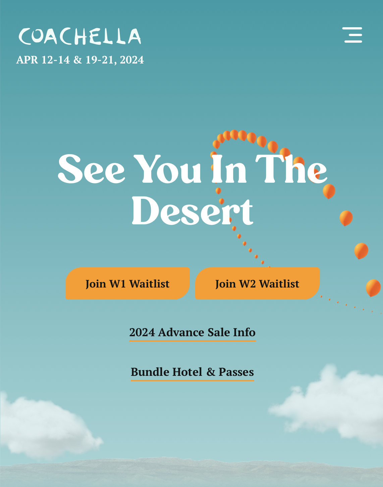

    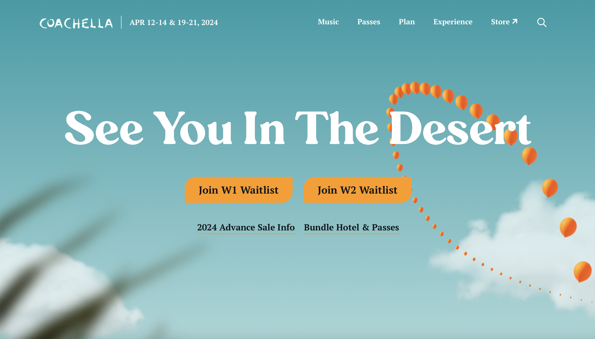

2. Edingburgh Festival <https://www.edfringe.com/>

    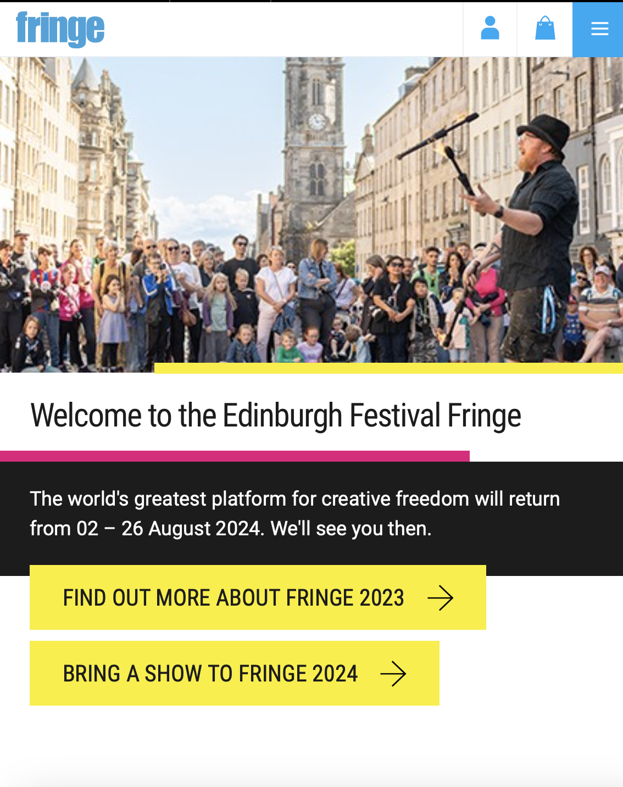

    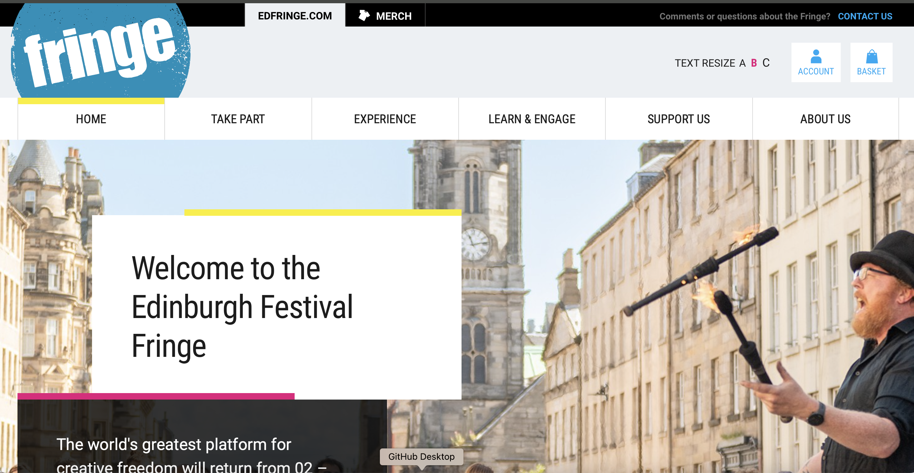

3. Kings County Festival <https://www.kingscountyfiberfestival.org>

    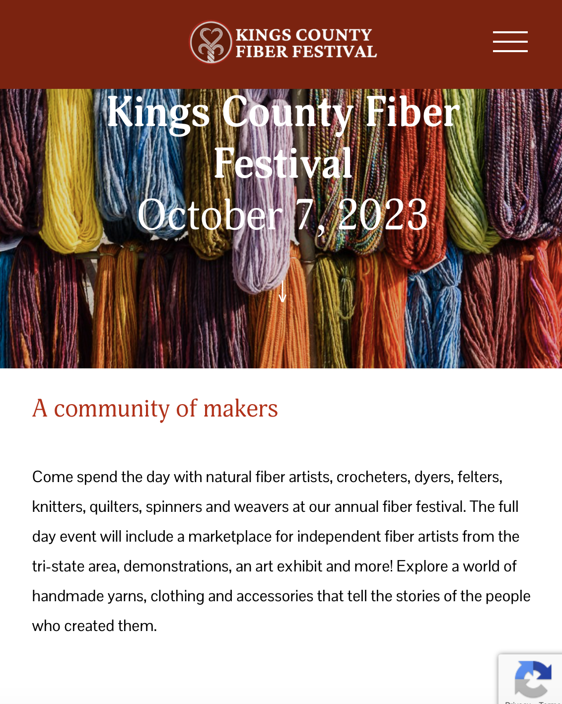

    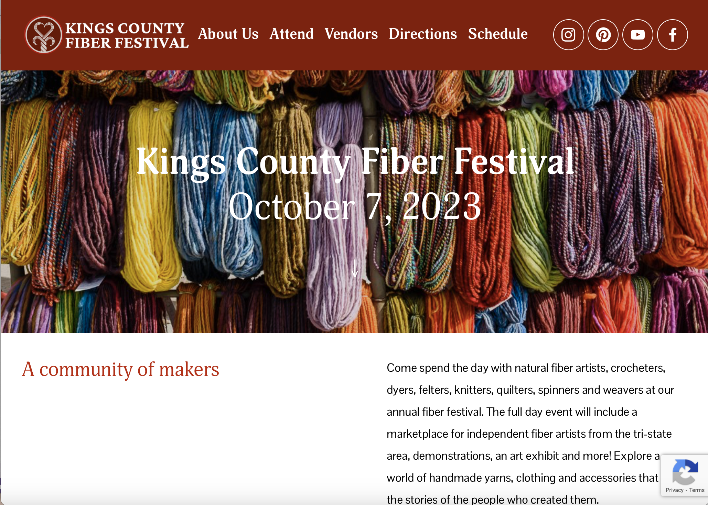

### Festival/Event Website 1 Review (Milestone 1)
> Review the website you identified above. (2-3 sentences)
> In your review, include a discussion common design patterns in the site.

The Coachella website exhibits a sleek and visually captivating design. Common design patterns include a navigation bar for easy access to essential information, high-quality visuals showcasing the festival's vibe, and a well-organized layout for lineup details and ticket information. In terms of responsiveness, the site effectively adapts from wide to narrow screens, with the narrow version optimizing space by utilizing collapsible menus and maintaining a clean, user-friendly interface.

### Festival/Event Website 2 Review (Milestone 1)
> Review the website you identified above. (2-3 sentences)
> In your review, include a discussion common design patterns in the site.

The Edinburgh Festival Fringe website is impressively organized, offering a wealth of information in a user-friendly manner. Common design patterns include a navigation bar, a search functionality and also the side bar. The site seamlessly transitions from wide to narrow screens, maintaining accessibility and readability. In the narrow layout, the use of expandable sections enhances the user experience by efficiently utilizing limited space without compromising information delivery.

### Festival/Event Website 3 Review (Milestone 1)
> Review the website you identified above. (2-3 sentences)
> In your review, include a discussion common design patterns in the site.

The Kings County Festival website is highly comprehensive, featuring six pages accessible through a user-friendly navigation bar. Notable sections include a vendor list, events schedule, and direction information. The site's adaptability across narrow and wide layouts ensures a seamless experience. Common design patterns include the use of side bar, and the navigation bar.

## Content Planning (Milestone 1)

Plan your site's content.

### Your Site's Planned Content (Milestone 1)
> List **all** the content you plan to include your website.
> You should list all types of content you planned to include (i.e. text, photos, images, etc.)
> **Do not place the content directly in the design journey.** Simply list it here. \
> i.e. Provide a brief description of each piece of content you intend to include.

- introduction and welcoming to apple festival (text)
- date and location of this year's festival
- social media contact
- things to do in ithaca (text)
- festival hours (text)
- festival history (text)
- festival entertainment (text)
- directions & parking (text)
- map of festival (pitcure)
- pictures of apples
- photos of things available at festival
- photos of ithaca
  

### Content Justification (Milestone 1)
> Explain (about a paragraph) why this content is the right content for your site's audience and how the content addresses their goals.

I chose those content to meet the needs and interests of our target audience—potential first-time visitors from other cities attending the Ithaca Apple Harvest Festival. The introduction provides a friendly and informative welcome, setting the stage for their exploration of Ithaca's unique offerings. Details about festival hours and available festival entertainment ensure a well-planned and enjoyable experience, catering to their desire for a seamless visit. The inclusion of a festival history adds depth and context, fostering a connection to the local heritage. Practical information like directions and parking directly addresses the concerns of those traveling by car. Visual elements, including images of apples, festival food, and the city of Ithaca, are chosen to immerse and entice the audience in the vibrant and welcoming atmosphere of the festival. Social media contacts facilitate ongoing engagement, creating a sense of community even after the festival concludes. 

## Information Architecture (Milestone 1)

### Content Organization (Milestone 1)
> Document your **iterations** of card sorting here. You must have at least 1 iteration of card sorting.
> Include photographic evidence of each iteration of card sorting **and** description of your thought process for each iteration.
> Please physically sort cards; please don't try and do this digitally.

#### First iteration
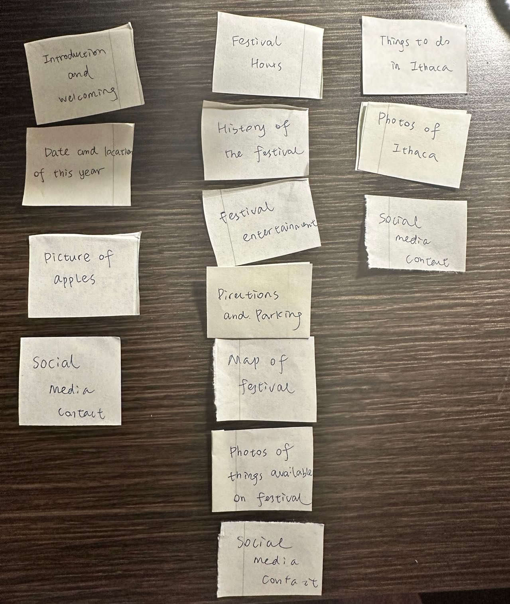
I did this iteration because firstly I wanted to set up the website to be a light website with 3 pages. I decided to contain 'homepage', 'about' page and also 'ithaca' page. For them, as they will first look at the homepage, I've put everything most important in homepage, such as date and location of the festival. For the about page, there's more details on the festival enabling the visitors to get the details they may want to look at, such as the map of the festival, or the parking information. At the third Ithaca page, I put everything related to Ithaca here with photos to provide the audience a more straghtforward view. Throughout the three pages they can always find the social media information at the bottom of each page, which could attract them effectively to find more up-to-date information on those platforms.

### Final Content Organization (Milestone 1)
> Which iteration of card sorting will you use for your website?

The first one.

> Explain how the final organization of content is appropriate for your site's audiences.

The final organization of content caters to the needs and preferences of the site's audience—potential first-time visitors from other cities attending the Ithaca Apple Harvest Festival. The homepage prioritizes essential information like the festival's date, location, and social media contacts, ensuring quick access to crucial details. The about page provides in-depth information for those seeking a comprehensive understanding of the festival, including hours, history, entertainment, and practical details like directions and parking. The Ithaca page focuses on showcasing the charm of Ithaca, aligning with the audience's potential interest in exploring the city. This concise and structured grouping ensures a user-friendly experience, delivering relevant information efficiently and creating an engaging narrative tailored to the festival's diverse audience.

### Navigation (Milestone 1)
> Please list the pages you will include in your website's navigation.

- Home
- About
- Ithaca

> Explain why the names of these pages make sense for your site's audience.

The pages named "Home," "About," and "Ithaca" make sense for the site's audience, because they can give a straightforward and intuitive navigation structure. "Home" could be a welcoming start point, providing important festival details at a first look. "About" caters to those seeking comprehensive festival information, details on history, hours, entertainment, and practicalities. "Ithaca" aligns with the audience's potential interest in exploring the city, offering insights and visuals to complement their festival experience. The page names are designed for clarity, ensuring visitors easily locate the information they desire, enhancing their overall user experience.

## Visual Theme (Milestone 1)
> Discuss several (more than two) ideas about styling your site's theme. Explain why the theme ideas are appropriate for your target audiences. Note the theme you selected for your site and why it's appropriate for the audience and their goals.

Idea 1: The initial concept centers around embracing the essence of fall as the primary theme for the website. This involves incorporating autumn colors, such as various shades of browns and greens, and featuring apples as background images. The aim is to create a visually appealing and seasonally relevant design that resonates with the festival's ambiance and appeals to the audience's connection with the fall harvest.

Idea 2: The second idea is to focusing on the festival's core offerings — food and local vendors. This theme revolves around apples and local vendors, with backgrounds adorned with an array of fruits and vibrant images representing the diversity of vendors. The emphasis is on highlighting the festival's key attractions and creating an engaging visual experience that aligns with the audience's interest in the event's offerings.

Idea 3: Another option leans towards a more professional and impersonal aesthetic, while still incorporating images of fall, vendors, and food. This theme employs unique colored backgrounds, with a mix of blacks, browns, and whites, aiming to convey a sense of sophistication and professionalism. The objective is to balance a professional appearance with relevant festival imagery.

Final theme: The chosen theme is the first the fall theme idea. This choice aligns with the audience's interest in the Apple Harvest Festival, creating a visually appealing and immersive experience that captures the essence of the festival's seasonal charm. The fall theme resonates with the audience's goal of exploring the festival's unique local flavor, celebrating Ithaca's agricultural heritage, crafts, and community spirit, making it a fitting and engaging choice for the website.

## Design (Milestone 1)

Document your site's layout.

### Layout Exploration (Milestone 1)
> Iterate on your site's design through sketching.
> Sketch **both** the **narrow** and **wide** versions of the site.
> Here you are just exploring your layout ideas. You don't need to sketch every page.
> Provide an explanation for each sketch explaining the idea and the design patterns you are leveraging.

TODO: layout exploration sketches + explanation
#### Exploration 1
- Wide version:
  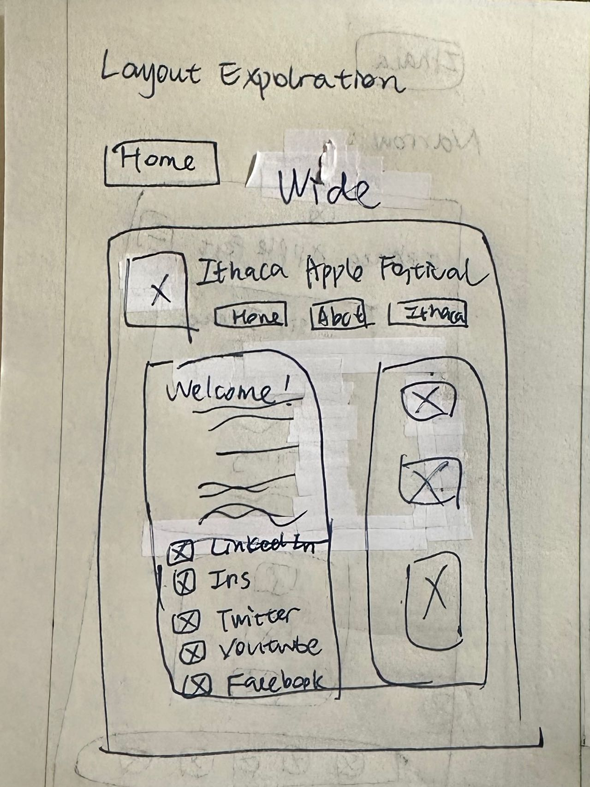
  In this design, I decided to use a logo in horizontal with the heading as well as the navigation bar, which could be more space-efficient and convey more information and content to the usesers at the first gliance. Also, I used a side bar to be aside the content with pictures to provide the visitors visual content at the same time. 

- Narrow version:
  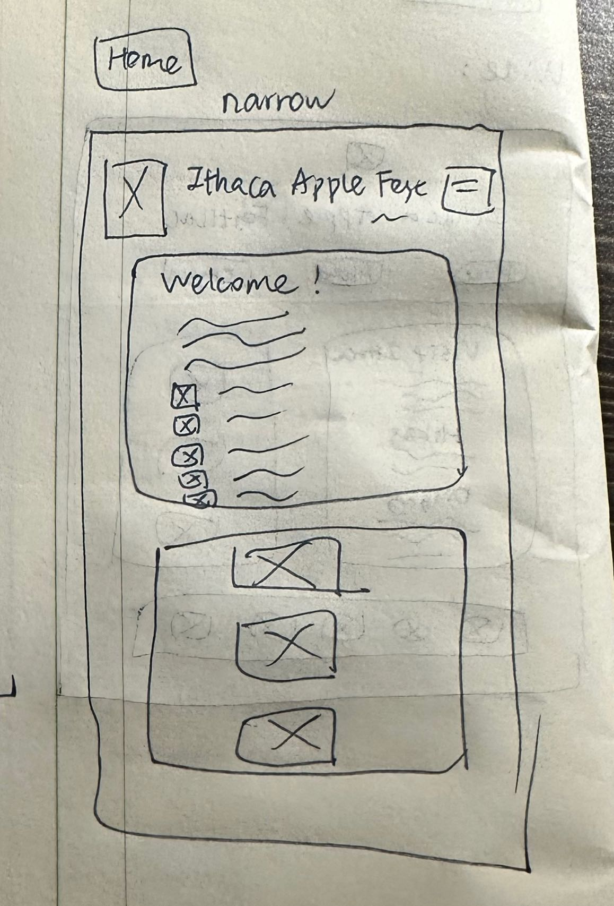
  In this narrow version, I decided to minimize the horizontal navigation bar to save space, and the side bar of pictures becomes downward the content. 

#### Exploration 2
- Wide version:
  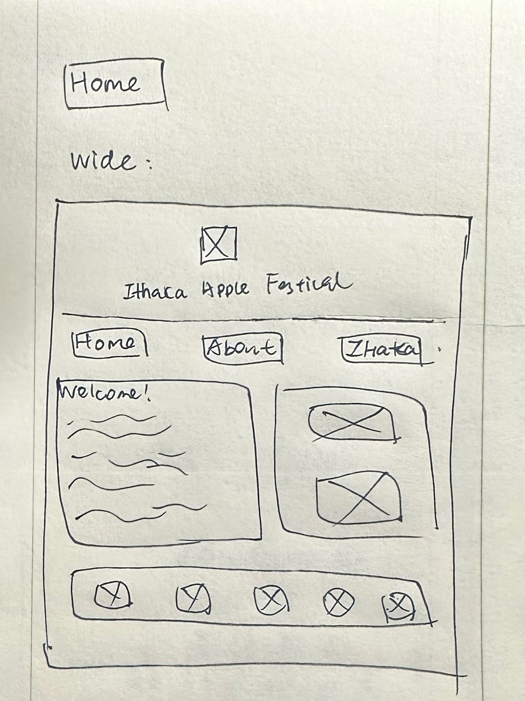
  In this exploration 2 design, I decided to change the logo to at the very top of the page, and followed by the title, and then the horizontal navigation bar. Also, I put the social media contacts at the bottom of the pages listing horizontally. In this way it will provide a better focus for the audience to the main content, while keeping them get easy access to the social media contacts. It is also more asethetically appealing.
  
- Narrow version:
  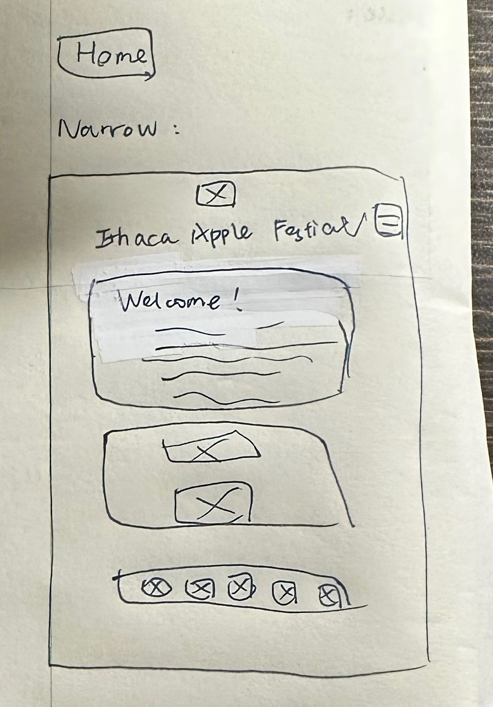
  In this narrow version, I decided to minimize the horizontal navigation bar to save space, and the side bar of pictures becomes downward the content. 

### Final Design (Milestone 1)
> Include the final sketches for **each** of your pages.
> Include both narrow and wide versions of each page.
> The sketches must include enough detail that another 1300 student could implement them.
> Provide an explanation for each sketch.

**Narrow Design:**

This is the final narrow version design for the homepage. As you can see I collapse the horizontal navigation bar into a button to save space in narrow view, and also putting the main content right below, and followed by the photos. There is also a horizontal bar of social media contact at the bottom of the page as a footer.

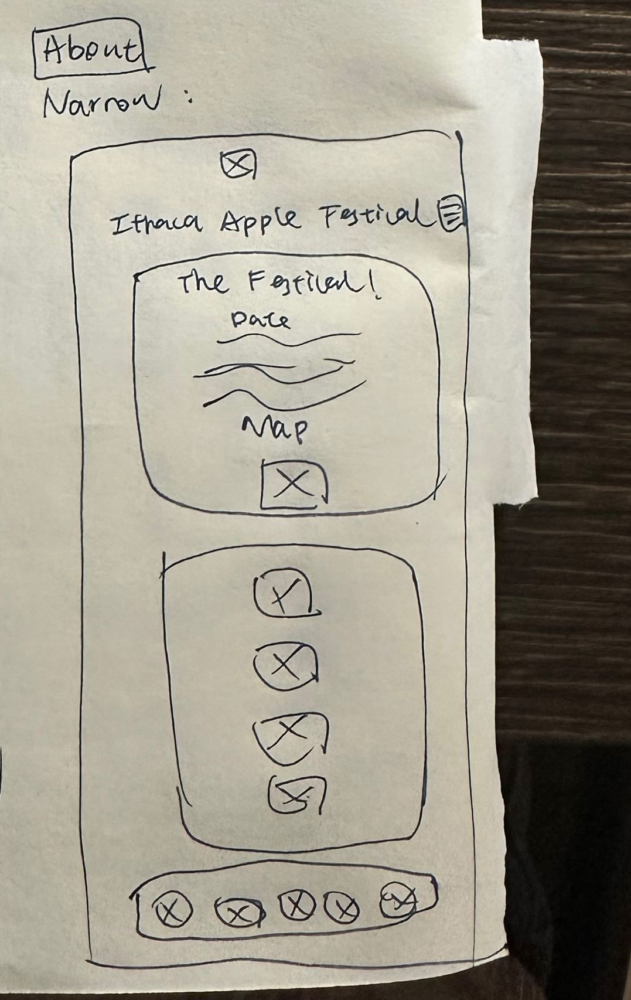
This is the final narrow version design for the about page. As you can see I collapse the horizontal navigation bar into a button to save space in narrow view, and also putting the main content right below, and followed by the photos. There is also a horizontal bar of social media contact at the bottom of the page as a footer.

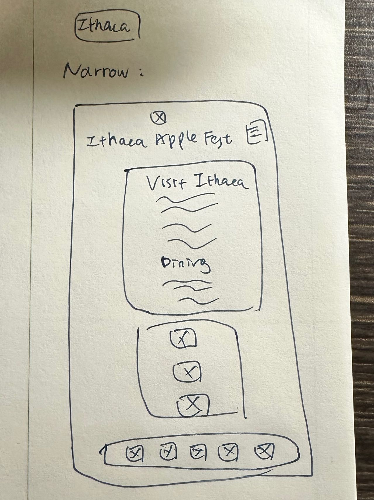
This is the final narrow version design for the ithaca page. As you can see I collapse the horizontal navigation bar into a button to save space in narrow view, and also putting the main content right below, and followed by the photos. There is also a horizontal bar of social media contact at the bottom of the page as a footer.

**Wide Design:**

This is the final wide version design for the homepage. I am using a horizontal navigation bar below the title, and using a side bar with pictures aside to the main content. There is also a horizontal bar of social media contact at the bottom of the page as a footer.

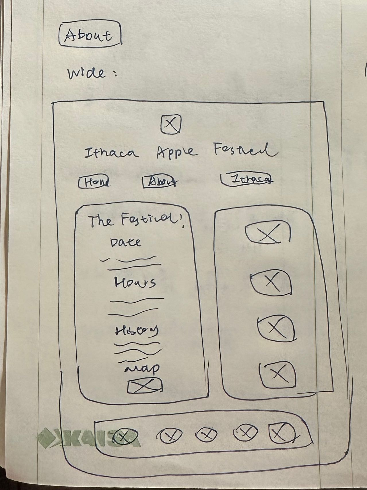
This is the final design for the about page. Similar as the homepage, I used a horizontal navigation bar below the title, and using a side bar with pictures aside to the main content. There is also a horizontal bar of social media contact at the bottom of the page as a footer just as in the homepage.

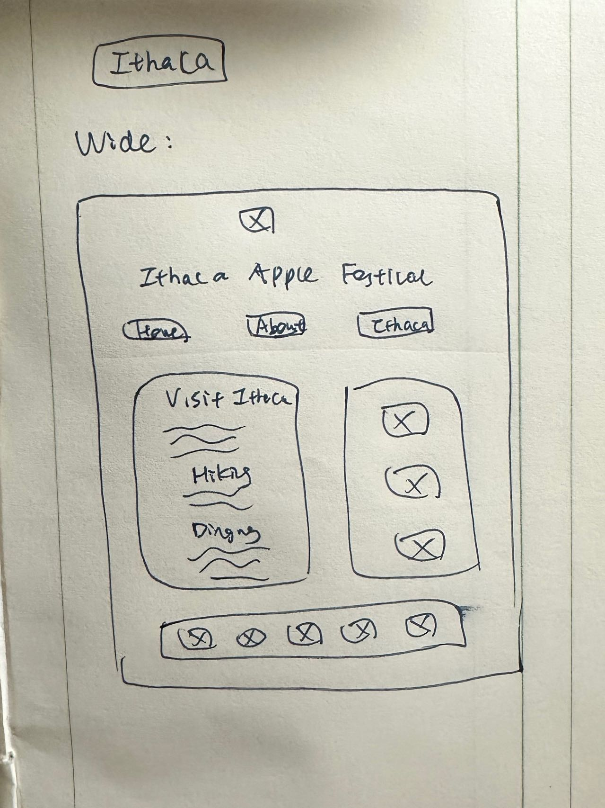
This is the final design for the ithaca page. Similar as the other pages, I consistently use the same horizontal navigation bar below the title, and using a side bar with pictures aside to the main content. There is also a horizontal bar of social media contact at the bottom of the page as a footer just as in the other two pages.

### Design Rationale (Milestone 1)
> Explain why your design is appropriate for your audience.
> Specially, why does your content organization, navigation, and site design/layout meet the goals of your users?
> How did you employ **design patterns** to improve the familiarity of the site for your audience?

I finally decided to use Exploration 2 for the whole web design, because this could be more asethetically appealing to my audience, and addressing more on the main website content, especially the use of the footer of the social contact informations. With my clear layout design and the use of sidebar, i minimized the distractions for my audience to the main content. In this way, they can get access to the most important information very quick, for example the date and location of the festival, which meet their goal perfectly. With the desing of the side bar pictures, they can also get the feeling of the festival, which is also meeting their goal.

I consistently using the same design patterns for my three pages: same heading part with logo at the beginning and the heading below and the navigation bar below, with main content aside with the side bar, and a footer at the bottom of the page. In this way, the visitors can easily know how to use and navigate between the three pages with the same design. 

## Rationale (Final Submission)

**This rationale should be polished writing:** one you might submit as a report to a client or boss to help explain the project and convince them you did a good job. You'll be surprised how much writing and communicating you need to do about projects and choices on internships and jobs; practice that here.

It should be a comprehensive, complete story of the project. You might find that each section runs about a paragraph. Sketches can often help tell the story of your design.

Your rationale should be a polished version of the earlier explanations.

### Audience (Final Submission)
> A complete and polished description of the intended audience(s) for your website.

The audience for this website is comprised of potential first-time visitors to the Ithaca Apple Harvest Festival who are traveling from other cities. This group of individuals shares a common interest in exploring the festival's unique local flavor, celebrating Ithaca's agricultural heritage, enjoying various crafts, and participating in the community spirit that the event embodies. Beyond the festival, these visitors also harbor a shared need for information about Ithaca town, reflecting a broader interest in understanding the local surroundings. The website aims to cater to the needs of these visitors who are seeking information to enhance their experience at the festival.

### Audience Goals
> Explain how your site's design addresses the goals of the audience.

For potential first-time visitors traveling to the Ithaca Apple Harvest Festival from other cities, several key goals guide their interaction with the website. One crucial aim is to obtain comprehensive information about directions and parking logistics. Recognizing the diverse modes of transportation, these visitors seek clarity on available bus options, parking locations, and associated fees. By addressing this goal, the website ensures that both local attendees and out-of-town visitors can plan their arrival seamlessly, contributing to a stress-free and enjoyable festival experience.

Another primary goal for the audience is to quickly access fundamental information about the festival. The website strategically places essential details, such as festival dates, location, and other pertinent information, on the homepage. These critical details are presented prominently with larger font sizes and clear design elements, ensuring that first-time visitors can swiftly grasp the key aspects of the event. Prioritizing this goal, the website aims to assist visitors in efficiently planning their trip and fostering a positive initial connection with the festival.

Also, they are also seeking for insights into the city of Ithaca. Acknowledging the curiosity of first-time visitors about the local attractions and place gto go  beyond the festival grounds, the website incorporates information about Ithaca's unique features. This goal aligns with the audience's desire to create a holistic experience, encouraging them to explore the city's charm and attractions during their stay, thereby enhancing their overall festival experience.

### Visual Design (Final Submission)
> An explanation of how the final design is appropriate for your audience.
> Include design patterns in your rationale.

The visual design of the website, inspired by the fall theme, is tailored to resonate with the audience's interest in the Ithaca Apple Harvest Festival. By incorporating autumn colors, such as warm browns and greens, and featuring images of apples, the design aims to create a visually engaging and seasonally relevant experience. This theme aligns with the festival's ambiance and appeals to the audience's connection with the fall harvest, fostering a sense of immersion and anticipation for the event.

The design patterns play a crucial role in enhancing the website's appropriateness for the audience. The consistent layout across most pages, featuring a recognizable header with the logo, festival title, and navigation bar, establishes a clear and familiar structure for users. This design pattern ensures that visitors can easily navigate through the website and locate essential information consistently, meeting their goals of obtaining directions, parking information, and basic details about the festival.

The use of a sidebar in pages About and Ithaca, presenting images of the festival and related content, serves to minimize distractions and keep the audience focused on the main content. This design pattern enhances the user experience by providing a visual representation of the festival's atmosphere and offerings, aligning with the audience's goal of getting a feel for the event. Additionally, the placement of the social media contact information in a horizontal bar at the bottom of each page serves as a familiar and easily accessible element, reinforcing the website's user-friendly design.

From wide screen to narrow screen, responsive design has been employed, with the horizontal navigation bar changing to be vertically presented, and side bars being shifted to be vertically followed with the main content. In this way it makes the content easier to read and access for visitors.

In summary, the fall theme and the chosen design patterns collectively contribute to an appropriate visual design for the audience. The cohesive layout and thematic elements create an immersive and user-friendly experience, aligning with the audience's goals and enhancing their engagement with the Ithaca Apple Harvest Festival website.

### Self-Reflection (Final Submission)
> Take some time here to reflect on how much you've learned since you started this class. It's often easy to ignore our own progress. Take a moment and think about your accomplishments in this class. Hopefully you'll recognize that you've accomplished a lot and that you should be very proud of those accomplishments!

First and foremost, I have learned how to conduct effective user interviews, a skill that is invaluable in the field of web design. Understanding how to ask the right questions and listen actively to the feedback of individuals at the Ithaca Apple Harvest Festival was a transformative experience. This knowledge has not only enhanced my web design skills but has also improved my ability to empathize with end users.

In terms of technical skills, I have gained a solid grasp of responsive design principles, including the use of flexboxes and media queries. These techniques have allowed me to create websites that adapt to various screen sizes and devices, providing a better user experience.

Furthermore, I now have a deeper understanding of how to identify and target specific audiences. My project involving the Ithaca Apple Harvest Festival allowed me to explore strategies for reaching a local audience effectively. This knowledge is essential for creating web designs that resonate with the intended user base.

## Grading (Final Submission)

### Collaborators
> List any persons you collaborated with on this project.

You Wu

### Reference Resources
> Please cite any external resources you referenced in the creation of your project.
> (i.e. W3Schools, StackOverflow, Mozilla, etc.)

W3Schools
StackOverflow
Mozilla

