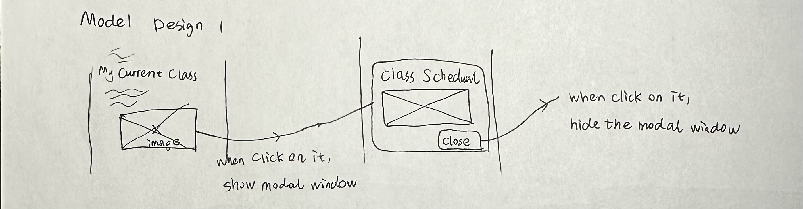
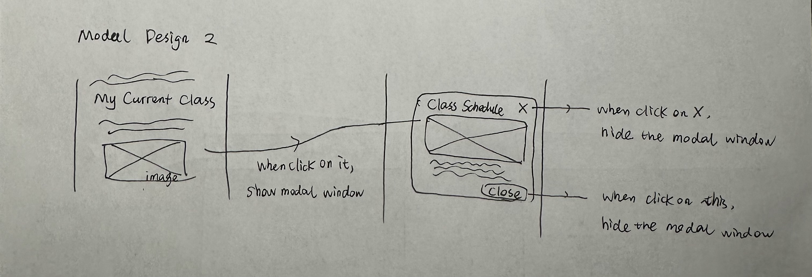
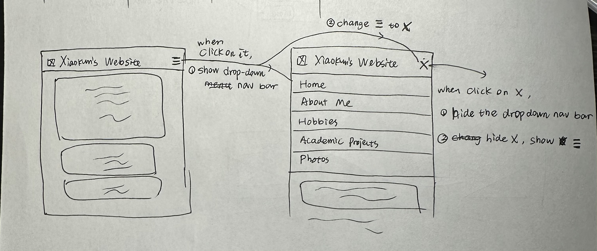
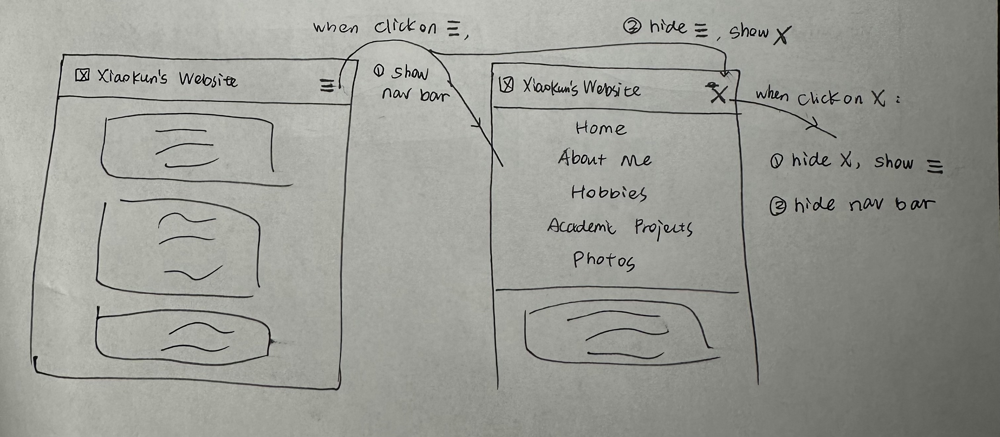
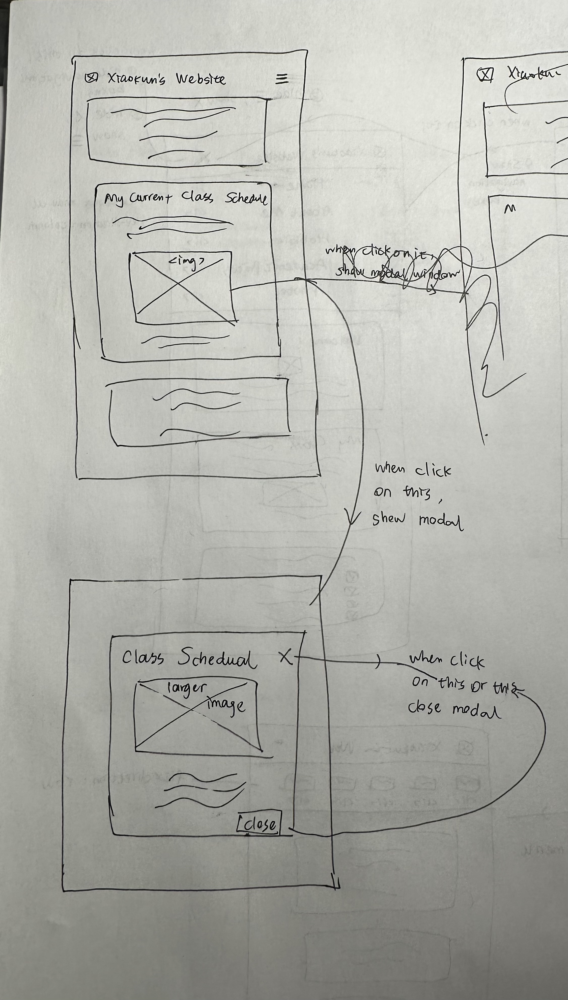
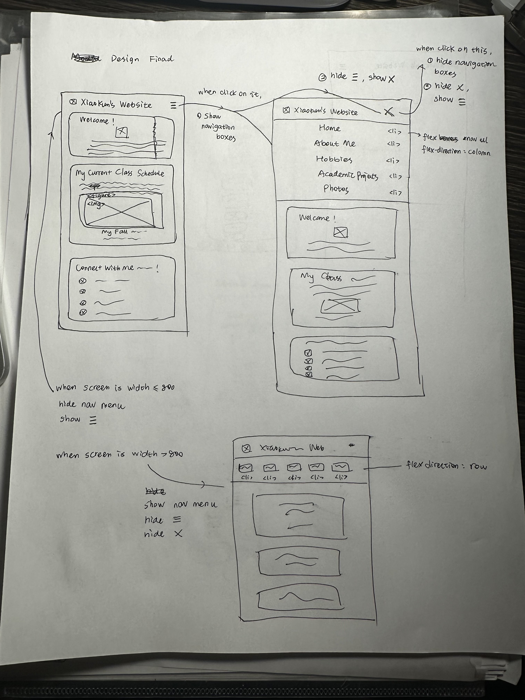
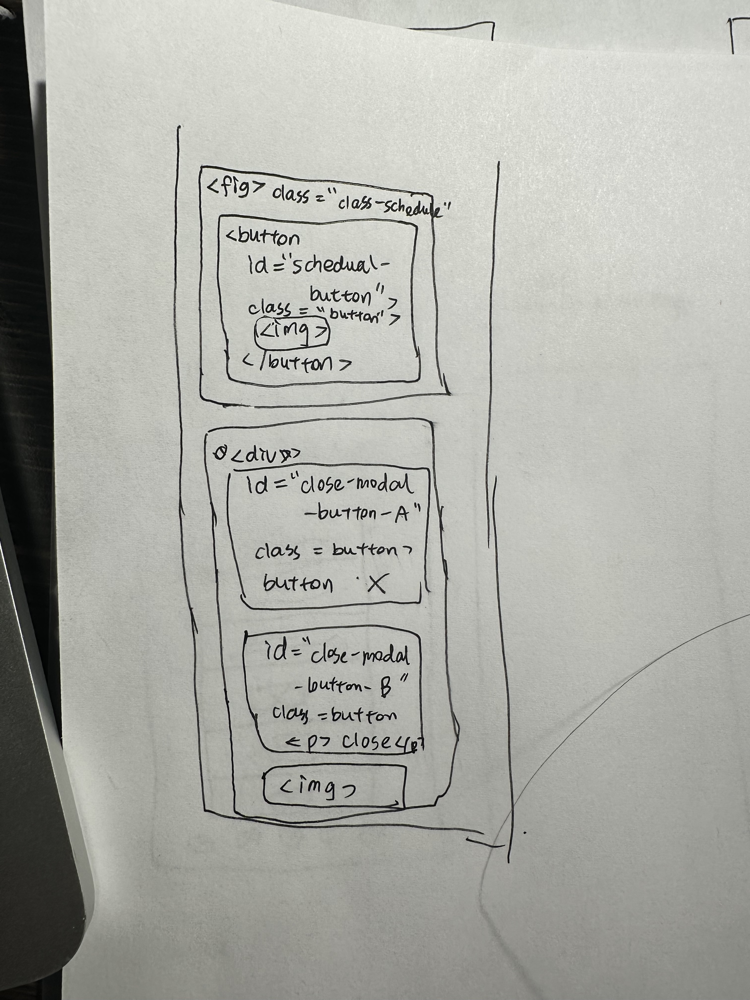

# Project 3: Design Journey

**For each milestone, complete only the sections that are labeled with that milestone.** Refine all sections before the final submission.

You are graded on your design process. If you later need to update your plan, **do not delete the original plan, leave it in place and append your new plan _below_ the original.** Then explain why you are changing your plan. Any time you update your plan, you're documenting your design process!

**Replace ALL _TODOs_ with your work.** (There should be no TODOs in the final submission.)

Be clear and concise in your writing. Bullets points are encouraged.

Place all design journey images inside the "design-plan" folder and then link them in Markdown so that they are visible in Markdown Preview.

**Everything, including images, must be visible in _Markdown: Open Preview_.** If it's not visible in the Markdown preview, then we can't grade it. We also can't give you partial credit either. **Please make sure your design journey should is easy to read for the grader;** in Markdown preview the question _and_ answer should have a blank line between them.


## Existing Project (Milestone 1)

**Tell us about the project you'll be using for Project 3.**

### Project (Milestone 1)
> Which project will you add interactivity to enhance the site's functionality?

Project 1


### Audience (Milestone 1)
> Briefly explain your site's audience. (1-2 sentences)
> Be specific and justify why this audience is a **cohesive** group.

The intended audience for my personal website is my university classmates within my department (engineering department). 

It is a cohesive group, beacuse they are individuals who are interested in collaborating with me on course projects, studying together, and getting to know each other better. They share the common goals of improving academic performance, doing better group work, and building connections within the university community.

This audience is appropriate for my website, as I will contain my basic information, contact information, hobbies, class schedule and my previous engineering projects in my website, which could be very useful for my classmates who are also doing engineering to know, and may lead to a further friendship, a meeting schedule in groupwork or a cooperation in any engineering project.


### Audience's Goals (Milestone 1)
> List the audience's goals that you identified in Project 1 or 2.
> Simply list each goal. No need to include the "Design Ideas and Choices", etc.
> You may adjust the goals if necessary.

- Contact Information Access: Peers and classmates can easily find all my contact details, making it simpler to reach out for collaborative purposes or casual interactions.
- Schedule Checking: Students in my classes can quickly reference my schedule to plan study sessions or group meetings, enhancing teamwork and collaboration.
- Get Shared Interests: Visitors can explore my hobbies and interests like music or football, potentially leading to conversations and connections over common activities.


## Interactivity Design (Milestone 1)

### Modal Interactivity Brainstorm (Milestone 1)
> Using the audience goals you identified, brainstorm possible options for **modal** interactivity to enhance the functionality of the site while also assisting the audience with their goals.
> Briefly explain each idea and provide a brief rationale for how the interactivity enhances the site's functionality for the audience. (1 sentence)
> Note: You may find it easier to sketch for brainstorming. That's fine too. Do whatever you need to do to explore your ideas.

- Idea 1: add a modal of a larger image of the screenshot of my current class schedule on the homepage when it is clicked.
Rational: with a larger image of my class schedule on the homepage, it could be much more clear for the visitors to see what is my schedule which can be complex, especially on narrow screen devices. In this way, it assists effectively my audience's goal of schedule checking, enhancing teamwork and collaboration.
- Idea 2: add a modal of a larger image of a photo I took as my photography hobbies in the photo gallary page when they click on it.
Rational: with a larger image of the photo, my audience would be able to get a clearer view of my creations, which they may be interested in, thus enhancing their experience as well as their goal of finding potential shared interest.

### Interactivity Design Ideation (Milestone 1)
> Explore the possible design solutions for the interactivity.
> Sketch at least two iterations of the modal and at least two iterations of the hamburger menu interactivity.
> Annotate each sketch explaining what happens when a user takes an action. (e.g. When user clicks this, something else appears.)

#### Modal Design Iteration 1


#### Modal Design Iteration 2


#### Hamburger Design Iteration 1


#### Hamburger Design Iteration 2



### Final Interactivity Design Sketches (Milestone 1)
> Create _polished_ sketch(es) (it's still a sketch, but with a little more care taken to communicate ideas clearly to the graders) to plan your interactivity.
> **Sketch out the entire page where your interactivity will go.**
> Include your interactivity to the sketch(es).
> Add annotations to explain what happens when the user takes an action.
> Include as many sketches as necessary to communicate your design (ask yourself, could another 1300 take these sketches an implement my design?)

**Modal design sketches:**



**Hamburger drop-down navigation menu design sketches:**



### Interactivity Rationale (Milestone 1)
> Describe the purpose of your proposed interactivity.
> Provide a brief rationale explaining how your proposed interactivity addresses the goals of your site's audience.
> This should be about a paragraph. (2-4 sentences)

For the **modal design**, I used a modal to present a larger image of my classes schedule, which could enhance my audience's experience for their goal of checking my shcedule for possible teamwork or meetings. For the employment of **hamburger menu**, it offers a cleaner and more streamlined view for the audience, preserving valuable space for the real content and reducing visual clutter, which could effectively benefit and convinient the audience who are looking for the important contents (my contact information, class schedules, my hobbies) for their goals of getting contacts, checking schedule and finding share interests.

## Interactivity Implementation Plan (Milestone 1)

### Interactivity Planning Sketches (Milestone 1)
> Produce planning sketches that include all the details another 1300 student would need to implement your interactivity design.
> Your planning sketches should include _all_ HTML elements needed for the interactivity; _annotations_ for the element types, their unique IDs, and CSS classes; and lastly the initial CSS classes.

**Modal planning sketches:**





**Hamburger drop-down navigation menu planning sketches:**


### Interactivity Pseudocode Plan (Milestone 1)
> Write your interactivity pseudocode plan here.
> Pseudocode is not JavaScript. Do not put JavaScript code here.

**Modal pseudocode:**

Open the modal:

```
when #schedule-button is clicked (event):
    remove .hidden to #schedule-modal
```

Close the modal:

```
when #close-modal-button-A is clicked or #close-modal-button-B is clicked (event):
    add .hidden to #schedule-modal
```

**Hamburger menu pseudocode:**

Pseudocode to show/hide (toggle) the navigation menu (narrow screens):

```
when #ham-button is clicked (event):
    add .hidden to #ham-button
    remove .hidden to #close-ham-button
    remove .hidden to #nav-menu
```
```
when #close-ham-button is clicked (event):
    add .hidden to #close-ham-button
    add .hidden to #nav-menu
    remove .hidden to #ham-button
```

Pseudocode to hide the hamburger button and show the navigation bar when the window is resized too wide:

```
when window width > 800px (event):
    add .hidden to #ham-button
    add .hidden to #close-ham-button
    remove .hidden to #nav-menu
```

Pseudocode to show the hamburger button and hide the navigation menu when the window is resized too narrow:

```
when window width <= 800px (event):
    add .hidden to #nav-menu
    add .hidden to #close-ham-button
    remove .hidden to #ham-button
```


## Grading (Final Submission)

### Interactivity Usability Justification (Final Submission)
> Explain how your design effectively uses affordances, visibility, feedback, and familiarity.
> Write a paragraph (3-5 sentences)

In my interactivity design, I employed a modal and a hamburger menu, effectively uses affordances, visibility, feedback and familarity. For the affordance, I used pointer cursor for every interacitivity element, making them look like a clickable button. For the feedback, I used hover in the button for the hamburger menu to bring effective feedback to the users.For the visibility, all the availble interactivity elements are correctly visible. For the familarity, I used common design pattern for the hamburger menu as well as the modal for the lager image, which is look familiar to the visitors.


### Tell Us What to Grade (Final Submission)
> We aren't re-grading your Project 1 or 2.
> We are only grading the interactivity you added.
> Tell us where (what pages) we can find your interactivity and how to use it.
> **We will only grade what you list here;** if it's not listed, we won't grade it.

**Hamburger Menu**
On the right top of each page. It only shows in narrow screen. 

**Modal for class schedule**
On the 'Home' page, scrolling down, 'My Fall 2023 Semester Schedule' picture. Click on this picture, a modal will show up. You can close the modal by clicking 'x' or 'close'.


### Collaborators (Final Submission)
> List any persons you collaborated with on this project.

No one.


### Reference Resources (Final Submission)
> Please cite any external resources you referenced in the creation of your project.
> (i.e. W3Schools, StackOverflow, Mozilla, etc.)

[Mozilla](https://developer.mozilla.org)

[W3Schools](https://www.w3schools.com)


### Self-Reflection (Final Submission)
> This was the first project in this class where you coded some JavaScript. What did you learn from this experience?

> Take some time here to reflect on how much you've learned since you started this class. It's often easy to ignore our own progress. Take a moment and think about your accomplishments in this class. Hopefully you'll recognize that you've accomplished a lot and that you should be very proud of those accomplishments!


In the first project of this course, I began to delve into the realm of JavaScript coding, a terrain previously unexplored for me. This journey proved both challenging and interesting. While checking with the syntax and debugging, I gradually felt the power of JavaScript in enhancing user experience. Through trial and error, I discovered that JavaScript is not merely a sequence of perplexing commands but a language that, when harnessed skillfully, can breathe life into static web pages.

The essence of my newfound understanding lies in the significant impact of JavaScript on user interaction. The ability to dynamically modify content and respond to user actions introduced a dynamic dimension to my projects. It dawned upon me that coding is not solely about crafting a functional backend but also about sculpting a seamless, intuitive frontend that beckons users with a friendly embrace. The introduction of modal pop-ups and the implementation of a hamburger menu in my recent project reflected a subtle dance of JavaScript, which enhanced user navigation and engagement.

Through this class, I acknowledge substantial growth in my understanding of web development concepts, particularly in HTML, CSS, and JavaScript. From grasping the fundamentals to implementing dynamic features, the progress is evident. Overall, the journey has given me confidence in navigating web development, making significant accomplishments worth celebrating.

